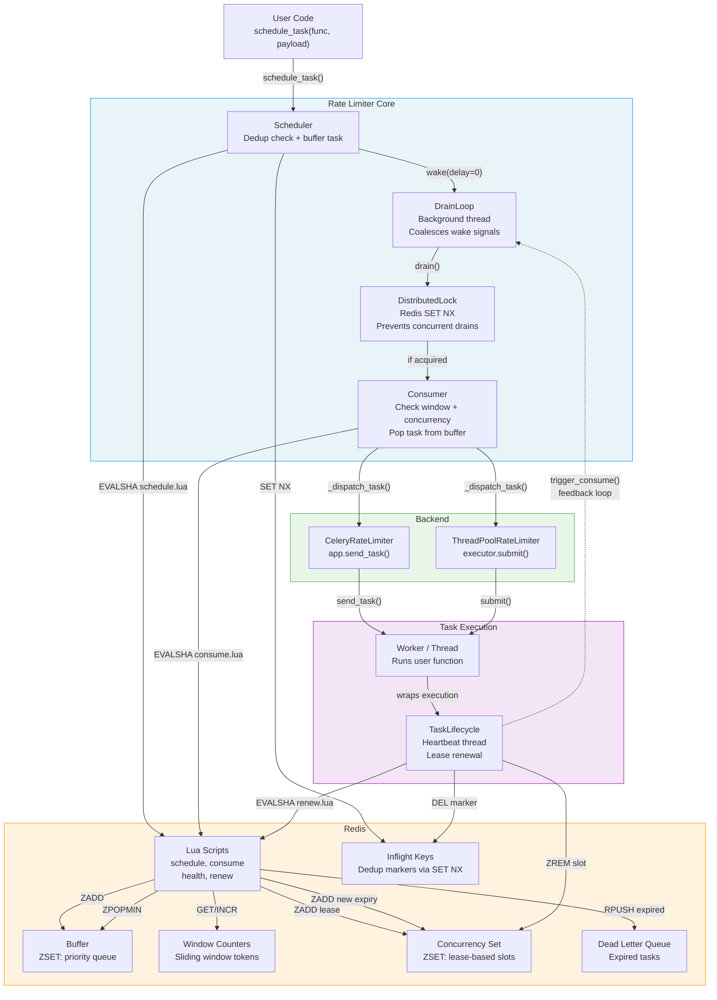
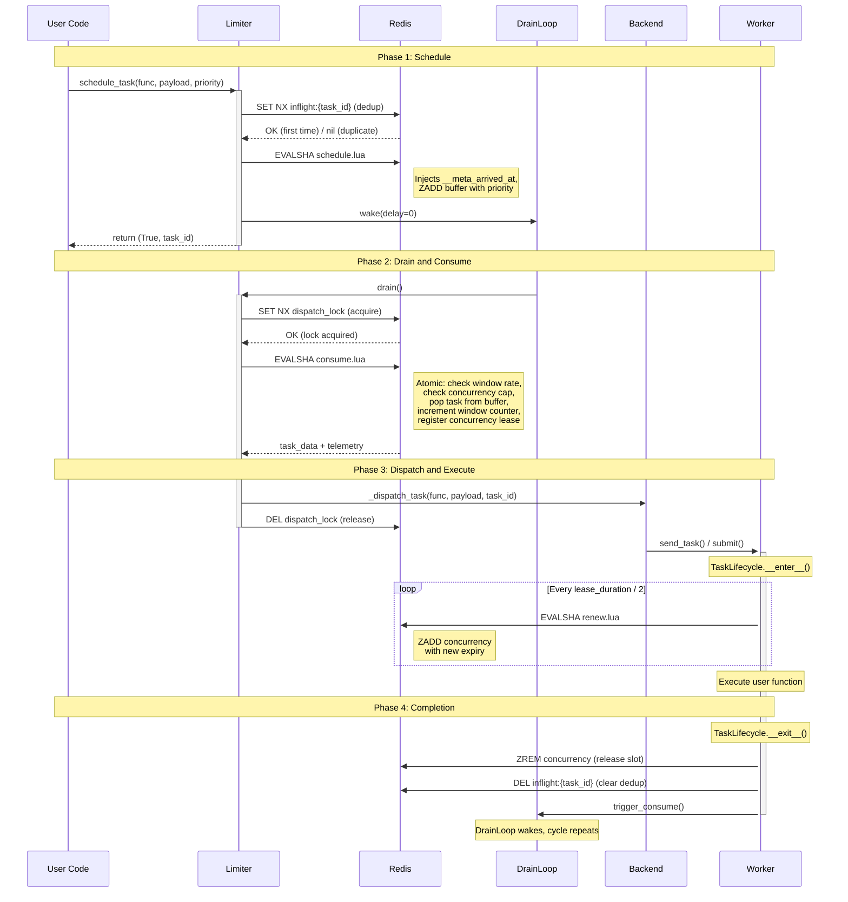
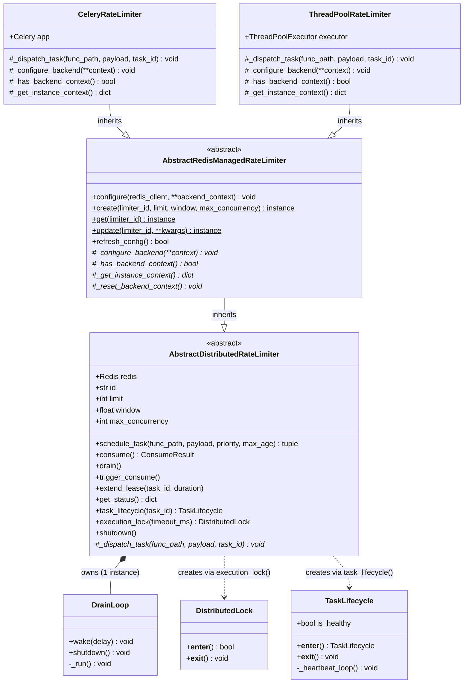

# Architecture Diagrams

This document presents a collection of diagrams that provide visual overviews of the system's architecture. The diagrams have been created using [Mermaid](https://mermaid.js.org/), such that they can be rendered natively on GitHub and produce meaningful diffs during code review.

The structure of this document is as follows. First, the *Component Diagram* in Section 1 depicts the major runtime components and their interactions. Subsequently, the *Task Lifecycle Sequence* in Section 2 traces the flow of a single task through the system. Finally, the *Class Hierarchy* in Section 3 presents the inheritance and composition relationships between the classes.

## 1. Component Diagram

The component diagram provides a high-level overview of the system's architecture. It depicts the major runtime components and the interactions between them, and as such, it is intended to be the first point of reference when reading the codebase.

There are several aspects of the architecture that are worth highlighting:

- **Redis is the single source of truth** for all rate limiting state, i.e., all state mutations are performed through atomic Lua scripts that are executed on the Redis server.
- **The feedback loop**: upon task completion, the `TaskLifecycle` component signals the `DrainLoop` to wake up and fill the freed concurrency slot with the next buffered task. Said feedback loop is the mechanism that keeps the throughput at the configured rate.
- **Backends are interchangeable**, which means that the core rate limiter is agnostic to the dispatch mechanism used, i.e., it does not need to know whether tasks are executed in Celery workers or local threads.

**Legend:**

- *Solid arrows* represent direct method calls or Redis commands.
- *Dashed arrow* represents the feedback loop, i.e., the path through which task completion triggers the next drain cycle.
- *Subgraph colors*: blue for the limiter core, orange for Redis, green for the backends and purple for the task execution layer.

## 2. Task Lifecycle Sequence

The sequence diagram traces the flow of a single task from the moment it is scheduled to the moment its execution completes. The diagram is divided into four phases, namely the *scheduling* phase, the *drain and consume* phase, the *dispatch and execution* phase and the *completion* phase. It should be noted that the diagram depicts the nominal flow exclusively. The handling of error conditions, such as script cache misses, lock contention and task expiration to the dead letter queue, is documented in the source code at [limiters.py](../src/celery_rate_limiter/core/limiters.py).

Several observations can be made about the lifecycle:

- **Scheduling is synchronous**, i.e., the caller receives the result `(True, task_id)` immediately upon scheduling.
- **Consumption is asynchronous**: the `DrainLoop` runs in a background thread and may fire milliseconds or seconds after the task has been scheduled.
- **Lua scripts are atomic**: `consume.lua` checks the rate window, verifies the concurrency capacity, pops the task from the buffer, increments the window counter and registers the concurrency lease, all within a single indivisible Redis operation. As such, race conditions between concurrent consumers are eliminated.
- **The heartbeat keeps the lease alive** during task execution. If the worker crashes, the lease expires and the concurrency slot is reclaimed automatically on the next consume invocation.
- **The cycle repeats**: the completion of a task triggers the `DrainLoop` to wake up and consume the next buffered task, which in turn closes the feedback loop.

## 3. Class Hierarchy

The class diagram presents the inheritance and composition relationships between the classes that constitute the rate limiter. It is intended to serve as a reference for developers that wish to extend the system with a new backend or understand the existing extension points.

The class hierarchy consists of two levels of abstraction:

- **`AbstractDistributedRateLimiter`** contains all of the core rate limiting logic, including the Lua script execution, drain orchestration and sliding window calculations.
- **`AbstractRedisManagedRateLimiter`** extends the base class with a registry pattern that provides a class-level API for the creation, retrieval and updating of limiter instances, with the configuration being persisted to Redis.

Concrete backends, such as `CeleryRateLimiter` and `ThreadPoolRateLimiter`, inherit from the managed class and are required to implement the following:

- **`_dispatch_task()`**, which defines how tasks are sent to the execution environment.
- **The four backend context methods** (`_configure_backend`, `_has_backend_context`, `_get_instance_context`, `_reset_backend_context`), which define how the backend is configured.

All other functionality is inherited from the abstract classes.

Furthermore, the supporting classes `DrainLoop`, `DistributedLock` and `TaskLifecycle` are *composed* rather than inherited. The `DrainLoop` is owned by the limiter and created during construction, whereas the `DistributedLock` and `TaskLifecycle` instances are created on demand through the factory methods `execution_lock()` and `task_lifecycle()` respectively.

**UML notation guide:**

| Symbol | Meaning |
|--------|---------|
| `+` | Public method or attribute |
| `#` | Protected method (intended for subclass use) |
| `-` | Private method (internal implementation) |
| `$` | Class method (called on the class, not an instance) |
| `*` | Abstract (must be implemented by subclasses) |
| `--\|>` | Inheritance (*is a*) |
| `*--` | Composition (*owns a*, created and destroyed together) |
| `..>` | Dependency (*uses*, creates on demand, does not own) |
