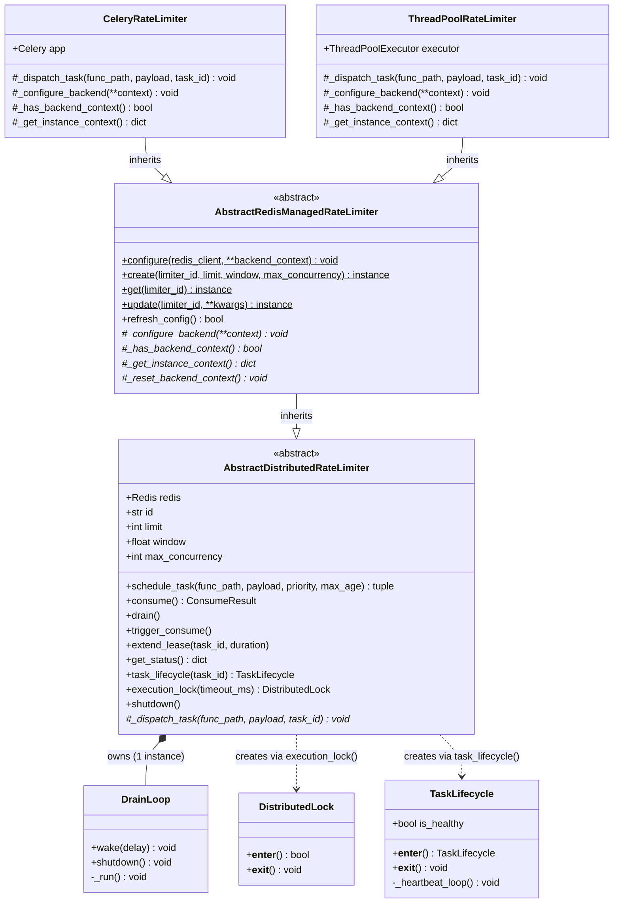

# Class Hierarchy

The class diagram presents the inheritance and composition relationships between the classes that constitute the rate limiter. It is intended to serve as a reference for developers that wish to extend the system with a new backend or understand the existing extension points.

The class hierarchy consists of two levels of abstraction:

- **`AbstractDistributedRateLimiter`** contains all of the core rate limiting logic, including the Lua script execution, drain orchestration and sliding window calculations.
- **`AbstractRedisManagedRateLimiter`** extends the base class with a registry pattern that provides a class-level API for the creation, retrieval and updating of limiter instances. Configuration is persisted to Redis as the source of truth; when `update()` writes new values to Redis, `refresh_config()` synchronises the in-memory instance attributes to match.

Concrete backends, such as `CeleryRateLimiter` and `ThreadPoolRateLimiter`, inherit from the managed class and are required to implement the following:

- **`_dispatch_task()`**, which defines how tasks are sent to the execution environment.
- **The four backend context methods** (`_configure_backend`, `_has_backend_context`, `_get_instance_context`, `_reset_backend_context`), which define how the backend is configured.

All other functionality is inherited from the abstract classes.

Furthermore, the supporting classes `DrainLoop`, `DistributedLock` and `TaskLifecycle` are *composed* rather than inherited. The `DrainLoop` is owned by the limiter and created during construction, whereas the `DistributedLock` and `TaskLifecycle` instances are created on demand through the factory methods `execution_lock()` and `task_lifecycle()` respectively.

**Notation guide:**

*Members:*

| Notation | Meaning |
|----------|---------|
| `+` prefix | Public method or attribute |
| `#` prefix | Protected method (intended for subclass use) |
| `-` prefix | Private method (internal implementation) |
| Underlined name | Class method (called on the class, not an instance) |
| *Italic name* | Abstract method (must be implemented by subclasses) |

*Relationships:*

| Arrow | Meaning |
|-------|---------|
| Solid line, hollow triangle head | Inheritance: the subclass *is a* specialisation of the parent class |
| Solid line, filled diamond | Composition: the parent *owns* the child and manages its lifecycle (created during construction, destroyed during shutdown) |
| Dashed line, open arrowhead | Dependency: the parent *creates* the child on demand via a factory method; the child has an independent lifecycle |
