# Class Hierarchy

The class diagram presents the inheritance and composition relationships between the classes that constitute the rate limiter. It is intended to serve as a reference for developers that wish to extend the system with a new backend or understand the existing extension points.

The class hierarchy is organized into four layers:

1. **`AbstractRateLimiter`** defines the core configuration attributes (`limiter_id`, `limit`, `window`) and configuration override hooks. Two specializations, `AbstractSyncRateLimiter` and `AbstractAsyncRateLimiter`, add Redis client management and Lua script registration using blocking and non-blocking clients respectively.
2. **`DistributedRateLimiterMixin`** is a pure Python mixin that encapsulates all task-oriented domain logic: key construction, task signature hashing, token recovery delay calculation, jitter computation, metric emission, and persist/override hooks for backend-specific configuration fields. This mixin is shared by both sync and async distributed rate limiters, avoiding code duplication.
3. **`AbstractDistributedRateLimiter`** (sync) and **`AbstractAsyncDistributedRateLimiter`** (async) combine the mixin with their respective Redis base class and add drain orchestration, task scheduling and consumption, lease management, and the threading/asyncio helpers (`DrainLoop`, `DrainSignalSubscriber`, `TaskLifecycle`).
4. **`ManagedRateLimiterMixin`** provides the singleton-style class API (`configure`, `create`, `get`, `update`, `refresh_config`) with Redis-backed configuration persistence. `SyncManagedRateLimiter` and `AsyncManagedRateLimiter` implement the Redis I/O for this pattern using blocking and non-blocking clients respectively.

Eight concrete backends compose these layers via multiple inheritance:

- **`CeleryRateLimiter(SyncManagedRateLimiter, AbstractDistributedRateLimiter)`**: dispatches tasks via `Celery.send_task()`.
- **`DramatiqRateLimiter(SyncManagedRateLimiter, AbstractDistributedRateLimiter)`**: dispatches tasks via `actor.send()`.
- **`HueyRateLimiter(SyncManagedRateLimiter, AbstractDistributedRateLimiter)`**: dispatches tasks via the Huey task wrapper.
- **`RQRateLimiter(SyncManagedRateLimiter, AbstractDistributedRateLimiter)`**: dispatches tasks via `Queue.enqueue()`.
- **`ProcessPoolRateLimiter(SyncManagedRateLimiter, AbstractDistributedRateLimiter)`**: dispatches tasks to a `ProcessPoolExecutor`. Task functions and payloads must be picklable; the task lifecycle (heartbeat, lease management) is managed in the parent process via a `Future` done callback.
- **`ThreadPoolRateLimiter(SyncManagedRateLimiter, AbstractDistributedRateLimiter)`**: dispatches tasks to a `ThreadPoolExecutor`.
- **`AsyncIOTaskLimiter(AsyncManagedRateLimiter, AbstractAsyncDistributedRateLimiter)`**: dispatches tasks via `asyncio.create_task()`.
- **`ASGIRateLimiter(AsyncManagedRateLimiter, AbstractAsyncRateLimiter)`**: provides a lightweight `acquire(key)` method for request-oriented rate limiting without task scheduling, buffer, or concurrency management.

Backends are required to implement `_dispatch_task()` (for task-oriented backends) and the five backend context methods (`_configure_backend`, `_has_backend_context`, `_get_instance_context`, `_reset_backend_context`, `_configure_hint`). Task-oriented backends may optionally override `_has_local_capacity()` to prevent the consumer from acquiring Redis concurrency slots for tasks that would only be queued locally.

The supporting classes come in sync and async pairs. For the sync path: `DrainLoop` (Thread + Lock + Condition), `DrainSignalSubscriber` (Thread + sync pubsub), and `TaskLifecycle` (Thread + Event). For the async path: `AsyncDrainLoop` (asyncio.Task + asyncio.Condition), `AsyncDrainSignalSubscriber` (asyncio.Task + redis.asyncio pubsub), and `AsyncTaskLifecycle` (asyncio.Task + asyncio.Event). All helpers are *composed* rather than inherited; the drain helpers are owned by the limiter and created during construction (unless `drain_enabled=False`), while lifecycle instances are created on demand through factory methods.

```mermaid
%%{init: {"theme": "default", "themeVariables": {"lineColor": "#6e7781"}}}%%
classDiagram
    class AbstractRateLimiter {
        <<abstract>>
        +str id
        +int limit
        +float window
        +_build_persist_config() dict
        +_apply_config_overrides(overrides) void
    }

    class AbstractSyncRateLimiter {
        <<abstract>>
        +Redis redis
        +_register_script(name) str
        +_eval_script(name, num_keys, *args) Any
    }

    class AbstractAsyncRateLimiter {
        <<abstract>>
        +AsyncRedis redis
        +async _register_script(name) str
        +async _eval_script(name, num_keys, *args) Any
        +async start() void
    }

    class DistributedRateLimiterMixin {
        <<mixin>>
        +int max_concurrency
        +int max_age
        +int lease_duration
        +str buffer_key
        +str concurrency_key
        +str dlq_key
        +_get_task_signature_str(func_path, payload) str
        +get_inflight_key(task_id) str
        +_calculate_token_recovery_delay() float
        +_calculate_smart_jitter() float
        +_emit_metric(event, data) void
    }

    class AbstractDistributedRateLimiter {
        <<abstract>>
        +schedule_task(func_path, payload, priority, max_age) tuple
        +acquire(timeout, priority) TaskLifecycle
        +consume() ConsumeResult
        +drain()
        +trigger_consume()
        +extend_lease(task_id, duration)
        +get_status() dict
        +get_buffer_count() int
        +task_lifecycle(task_id) TaskLifecycle
        +shutdown()
        #_dispatch_task(func_path, payload, task_id)* void
        #_has_local_capacity() bool
    }

    class AbstractAsyncDistributedRateLimiter {
        <<abstract>>
        +async start() void
        +async schedule_task() tuple
        +async acquire(timeout, priority) AsyncTaskLifecycle
        +async consume() ConsumeResult
        +async drain()
        +async trigger_consume()
        +async extend_lease()
        +async get_status() dict
        +async get_buffer_count() int
        +task_lifecycle(task_id) AsyncTaskLifecycle
        +async shutdown()
        #async _dispatch_task()* void
        #_has_local_capacity() bool
    }

    class ManagedRateLimiterMixin {
        <<mixin>>
        +_require_configured()$ void
        +_require_internal_construction(sentinel)$ void
        +_reset()$ void
        #_configure_backend(**context)* void
        #_has_backend_context()* bool
        #_get_instance_context()* dict
        #_reset_backend_context()* void
        #_configure_hint()* str
    }

    class SyncManagedRateLimiter {
        +configure(redis_client, **context)$ void
        +create(limiter_id, **config)$ instance
        +get(limiter_id)$ instance
        +update(limiter_id, **overrides)$ instance
        +refresh_config() bool
    }

    class AsyncManagedRateLimiter {
        +configure(redis_client, **context)$ void
        +async create(limiter_id, **config)$ instance
        +async get(limiter_id)$ instance
        +async update(limiter_id, **overrides)$ instance
        +async refresh_config() bool
    }

    class CeleryRateLimiter {
        +Celery app
        #_dispatch_task(func_path, payload, task_id) void
    }

    class DramatiqRateLimiter {
        +Broker broker
        #_dispatch_task(func_path, payload, task_id) void
    }

    class HueyRateLimiter {
        +Huey huey
        #_dispatch_task(func_path, payload, task_id) void
    }

    class RQRateLimiter {
        +Queue queue
        #_dispatch_task(func_path, payload, task_id) void
    }

    class ProcessPoolRateLimiter {
        +ProcessPoolExecutor executor
        #_dispatch_task(func_path, payload, task_id) void
        #_has_local_capacity() bool
    }

    class ThreadPoolRateLimiter {
        +ThreadPoolExecutor executor
        #_dispatch_task(func_path, payload, task_id) void
        #_has_local_capacity() bool
    }

    class AsyncIOTaskLimiter {
        +int max_tasks
        #async _dispatch_task(func_path, payload, task_id) void
        #_has_local_capacity() bool
        +async shutdown() void
    }

    class ASGIRateLimiter {
        +async acquire(key) AcquireResult
        +async start() void
    }

    AbstractSyncRateLimiter --|> AbstractRateLimiter : inherits
    AbstractAsyncRateLimiter --|> AbstractRateLimiter : inherits

    AbstractDistributedRateLimiter --|> DistributedRateLimiterMixin : inherits
    AbstractDistributedRateLimiter --|> AbstractSyncRateLimiter : inherits

    AbstractAsyncDistributedRateLimiter --|> DistributedRateLimiterMixin : inherits
    AbstractAsyncDistributedRateLimiter --|> AbstractAsyncRateLimiter : inherits

    SyncManagedRateLimiter --|> ManagedRateLimiterMixin : inherits
    AsyncManagedRateLimiter --|> ManagedRateLimiterMixin : inherits

    CeleryRateLimiter --|> SyncManagedRateLimiter : inherits
    CeleryRateLimiter --|> AbstractDistributedRateLimiter : inherits

    DramatiqRateLimiter --|> SyncManagedRateLimiter : inherits
    DramatiqRateLimiter --|> AbstractDistributedRateLimiter : inherits

    HueyRateLimiter --|> SyncManagedRateLimiter : inherits
    HueyRateLimiter --|> AbstractDistributedRateLimiter : inherits

    RQRateLimiter --|> SyncManagedRateLimiter : inherits
    RQRateLimiter --|> AbstractDistributedRateLimiter : inherits

    ProcessPoolRateLimiter --|> SyncManagedRateLimiter : inherits
    ProcessPoolRateLimiter --|> AbstractDistributedRateLimiter : inherits

    ThreadPoolRateLimiter --|> SyncManagedRateLimiter : inherits
    ThreadPoolRateLimiter --|> AbstractDistributedRateLimiter : inherits

    AsyncIOTaskLimiter --|> AsyncManagedRateLimiter : inherits
    AsyncIOTaskLimiter --|> AbstractAsyncDistributedRateLimiter : inherits

    ASGIRateLimiter --|> AsyncManagedRateLimiter : inherits
    ASGIRateLimiter --|> AbstractAsyncRateLimiter : inherits
```

**Notation guide:**

*Members:*

| Notation | Meaning |
|----------|---------|
| `+` prefix | Public method or attribute |
| `#` prefix | Protected method (intended for subclass use) |
| `-` prefix | Private method (internal implementation) |
| Underlined name | Class method (called on the class, not an instance) |
| *Italic name* | Abstract method (must be implemented by subclasses) |

*Relationships:*

| Arrow | Meaning |
|-------|---------|
| Solid line, hollow triangle head | Inheritance: the subclass *is a* specialization of the parent class |
| Solid line, filled diamond | Composition: the parent *owns* the child and manages its lifecycle |
| Dashed line, open arrowhead | Dependency: the parent *creates* the child on demand via a factory method |

**Composition (not shown in diagram for clarity):**

- `AbstractDistributedRateLimiter` owns `DrainLoop` (0..1) and `DrainSignalSubscriber` (0..1); creates `TaskLifecycle` via `task_lifecycle()`.
- `AbstractAsyncDistributedRateLimiter` owns `AsyncDrainLoop` (0..1) and `AsyncDrainSignalSubscriber` (0..1); creates `AsyncTaskLifecycle` via `task_lifecycle()`.
