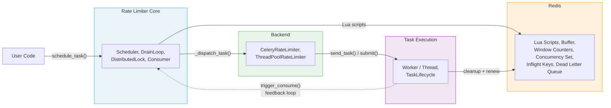
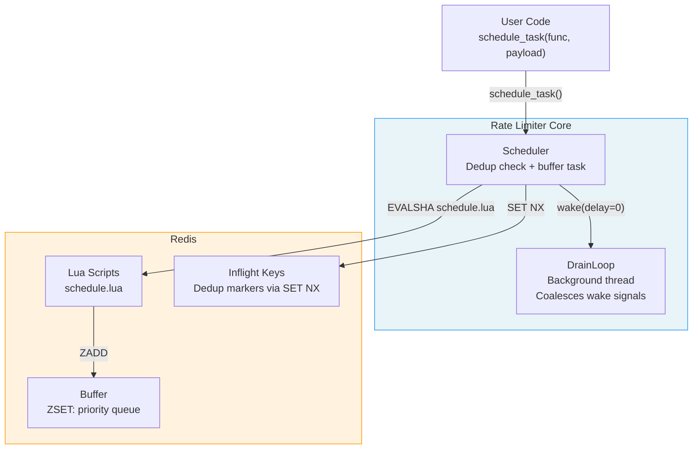
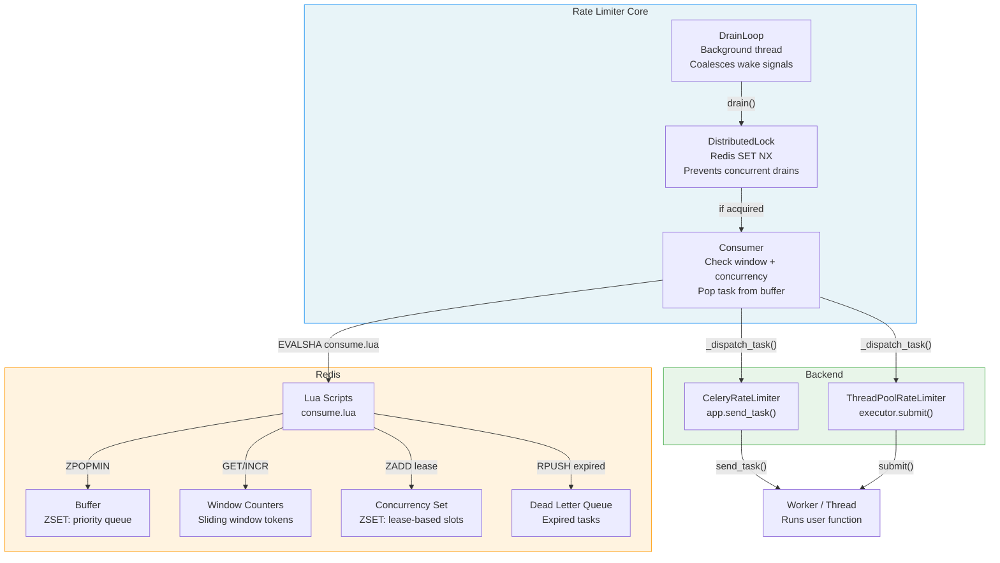
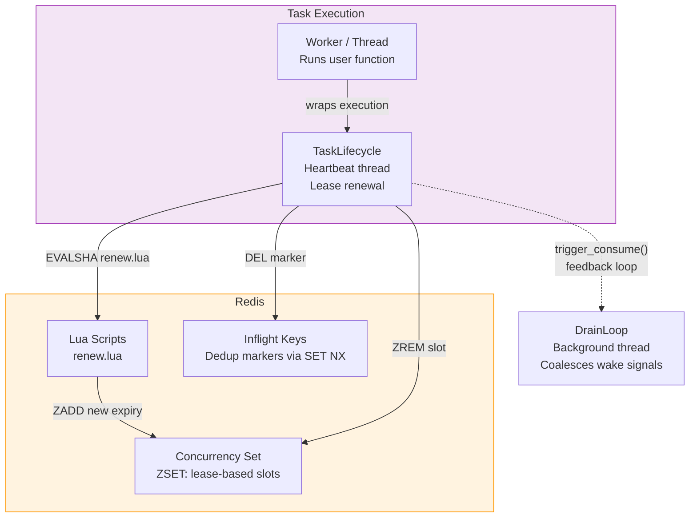

# Component Diagram

The component diagram provides a high-level overview of the system's architecture. It depicts the major runtime components and the interactions between them, and as such, it is intended to be the first point of reference when reading the codebase. The content is organised as four diagrams: an overview that shows the four architectural layers as abstracted blocks, followed by one detail diagram per phase (scheduling, drain/consume/dispatch, execution/completion). Each detail diagram is accompanied by a test coverage table that maps every interaction arrow to the test(s) that exercise it.

There are several aspects of the architecture that are worth highlighting:

- **Redis is the single source of truth** for all rate limiting state, i.e., all state mutations are performed through atomic Lua scripts that are executed on the Redis server.
- **The feedback loop**: upon task completion, the `TaskLifecycle` component signals the `DrainLoop` to wake up and fill the freed concurrency slot with the next buffered task. Said feedback loop is the mechanism that keeps the throughput at the configured rate.
- **Backends are interchangeable**, which means that the core rate limiter is agnostic to the dispatch mechanism used, i.e., it does not need to know whether tasks are executed in Celery workers or local threads.

## Overview

**Legend:**

- *Blue subgraph* (Rate Limiter Core): the scheduler, drain loop, distributed lock and consumer components that orchestrate task flow.
- *Orange subgraph* (Redis): all Lua scripts and data structures that constitute the single source of truth.
- *Green subgraph* (Backend): the interchangeable dispatch backends (Celery and ThreadPool).
- *Purple subgraph* (Task Execution): the worker or thread that runs the user function and the `TaskLifecycle` context manager that manages the concurrency lease.
- *Solid arrows* represent synchronous calls or Redis commands.
- *Dashed arrow* represents the feedback loop, i.e., the path through which task completion triggers the next drain cycle.

## Scheduling

The scheduling phase covers the path from user code to the Redis buffer. When `schedule_task()` is called, the scheduler acquires the inflight deduplication key, buffers the task via the `schedule.lua` Lua script, and wakes the drain loop.

**Test coverage:**

| Arrow | Interaction | Tested by |
|-------|-------------|-----------|
| User → Scheduler | `schedule_task()` called | `contracts/test_rate_limiter::test_schedule_task_returns_success_and_task_id` |
| Scheduler → LuaScripts | EVALSHA schedule.lua | `implementations/test_rate_limiter::test_schedule_single_task_stores_correctly`, `implementations/test_rate_limiter::test_lua_script_recovery_on_noscript_error` |
| Scheduler → Inflight | SET NX dedup marker | `contracts/test_rate_limiter::test_schedule_task_marks_task_as_inflight`, `implementations/test_rate_limiter::test_schedule_duplicate_task_skips_second` |
| Scheduler → DrainLoop | wake(delay=0) | `implementations/test_drain::test_trigger_consume_schedules_drain` |

## Drain, Consume, and Dispatch

The drain, consume and dispatch phase covers the path from the drain loop through consumption to backend dispatch. The drain loop acquires the distributed lock, the consumer invokes `consume.lua` to atomically check the rate window, verify concurrency capacity, pop a task from the buffer and register the concurrency lease, and then the consumer dispatches the task to the configured backend.

**Test coverage:**

| Arrow | Interaction | Tested by |
|-------|-------------|-----------|
| DrainLoop → Lock | drain() acquires dispatch_lock | `implementations/test_drain_loop::test_wake_fires_drain_immediately`, `implementations/test_drain::test_drain_schedules_backup_when_lock_contended` |
| Lock → Consumer | Lock acquired, proceed | `implementations/test_concurrent_access::test_distributed_lock_serializes_drains` |
| Consumer → LuaScripts | EVALSHA consume.lua | `contracts/test_rate_limiter::test_consume_returns_expected_structure`, `implementations/test_rate_limiter::test_consume_lua_script_recovery_on_noscript_error` |
| LuaScripts → WindowCounters | GET/INCR rate check | `integration/test_rate_limiting::test_basic_rate_limit_enforcement` |
| LuaScripts → ConcurrencySet | ZADD lease slot | `integration/test_rate_limiting::test_concurrency_limit_enforcement` |
| LuaScripts → DLQ | RPUSH expired task | `integration/test_rate_limiting::test_expired_task_moved_to_dlq` |
| Consumer → Backends | _dispatch_task() | `implementations/celery/test_celery_limiter::test_dispatch_task_use_executor_true_sends_generic_worker`, `implementations/threadpool/test_threadpool_limiter::test_dispatch_task_submits_to_executor` |
| Backends → Worker | send_task() / submit() | `implementations/celery/test_celery_limiter::test_dispatch_task_use_executor_false_sends_custom_task`, `implementations/threadpool/test_threadpool_limiter::test_dispatch_task_resolves_function_path` |

## Execution and Completion

The execution and completion phase covers the path from the worker through the `TaskLifecycle` context manager back to the drain loop. The lifecycle manages the heartbeat thread that renews the concurrency lease, and upon completion (or exception), it releases the concurrency slot, deletes the inflight deduplication key, and triggers the drain loop to consume the next buffered task.

**Test coverage:**

| Arrow | Interaction | Tested by |
|-------|-------------|-----------|
| Worker → Lifecycle | Wraps execution in TaskLifecycle | `implementations/test_decorator::test_decorator_wraps_function_in_task_lifecycle`, `implementations/threadpool/test_threadpool_limiter::test_dispatch_task_wraps_in_lifecycle` |
| Lifecycle → LuaScripts | EVALSHA renew.lua heartbeat | `implementations/test_task_lifecycle::test_heartbeat_loop_extends_lease_periodically` |
| Lifecycle → DrainLoop | trigger_consume() feedback loop | `contracts/test_task_lifecycle::test_lifecycle_triggers_consume` |
