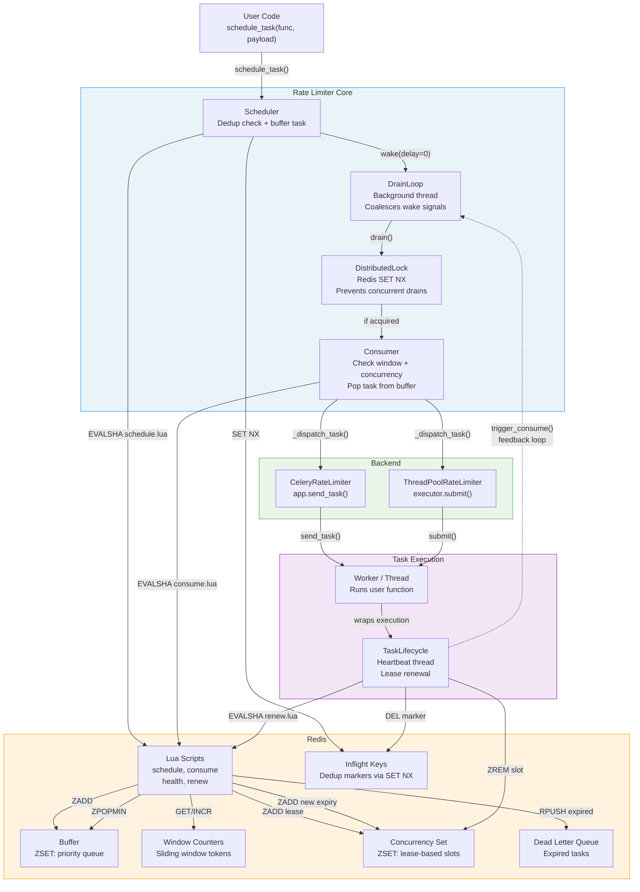

# Component Diagram

The component diagram provides a high-level overview of the system's architecture. It depicts the major runtime components and the interactions between them, and as such, it is intended to be the first point of reference when reading the codebase.

There are several aspects of the architecture that are worth highlighting:

- **Redis is the single source of truth** for all rate limiting state, i.e., all state mutations are performed through atomic Lua scripts that are executed on the Redis server.
- **The feedback loop**: upon task completion, the `TaskLifecycle` component signals the `DrainLoop` to wake up and fill the freed concurrency slot with the next buffered task. Said feedback loop is the mechanism that keeps the throughput at the configured rate.
- **Backends are interchangeable**, which means that the core rate limiter is agnostic to the dispatch mechanism used, i.e., it does not need to know whether tasks are executed in Celery workers or local threads.

**Legend:**

- *Solid arrows* represent direct method calls or Redis commands.
- *Dashed arrow* represents the feedback loop, i.e., the path through which task completion triggers the next drain cycle.
- *Subgraph colors*: blue for the limiter core, orange for Redis, green for the backends and purple for the task execution layer.
