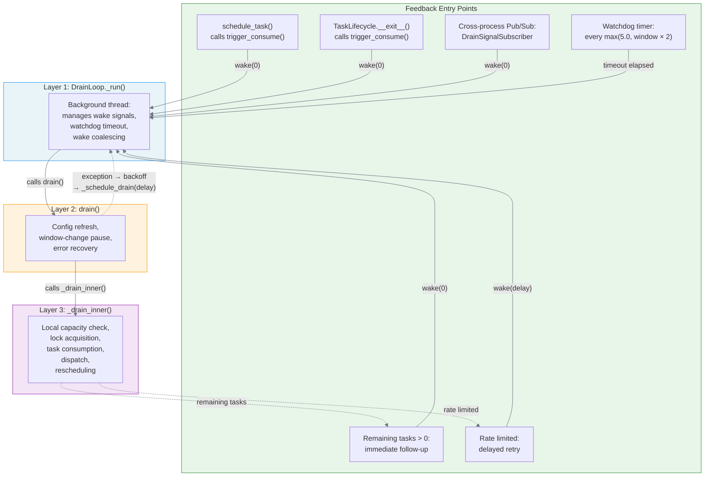
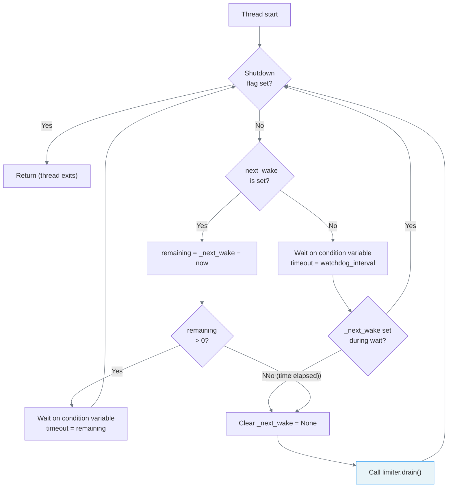
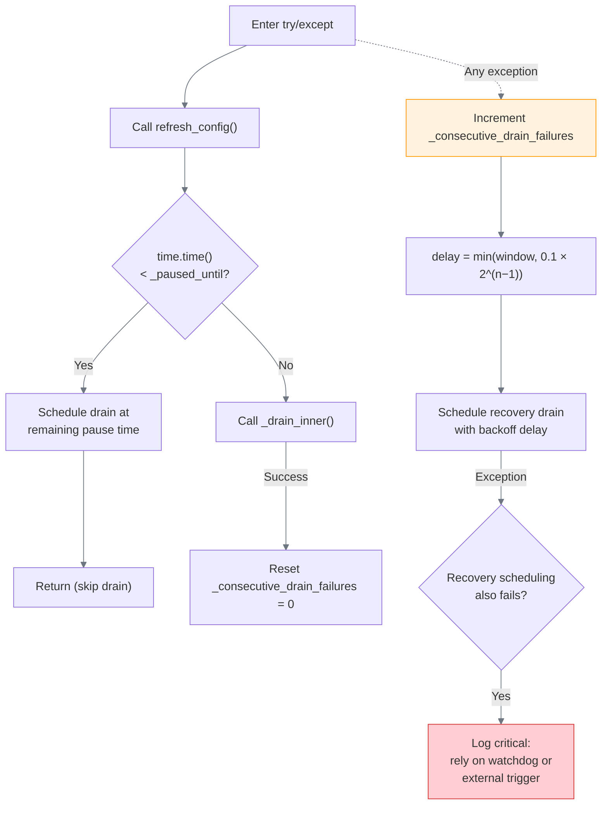

# Drain Loop Flow

The drain loop is a three-layer control loop that orchestrates the consumption and dispatch of buffered tasks. The outermost layer (`DrainLoop._run()`) is a background thread that manages wake signals and watchdog timing. The middle layer (`drain()`) handles configuration refresh, window-change pauses, error recovery, and exponential backoff. The innermost layer (`_drain_inner()`) performs the actual lock acquisition, task consumption, dispatch, and rescheduling. This document presents the control loop as four diagrams: an overview that shows how the layers connect, followed by one detailed flowchart per layer. Each detail diagram is accompanied by a test coverage table that maps every decision branch to the test(s) that exercise it.

## Overview



**Legend:**

- *Green subgraph* (Feedback Entry Points): the six triggers that drive the drain loop; see [Feedback Entry Points](#feedback-entry-points) for detailed descriptions.
- *Blue subgraph* (Layer 1): the `DrainLoop._run()` background thread.
- *Orange subgraph* (Layer 2): the `drain()` method.
- *Purple subgraph* (Layer 3): the `_drain_inner()` method.
- *Solid arrows* indicate synchronous call chains (Layer 1 → Layer 2 → Layer 3).
- *Dashed arrows* indicate asynchronous feedback loops (rescheduling, error recovery).

## Layer 1: DrainLoop._run()

The `DrainLoop._run()` background thread manages wake signals and watchdog timing. It sleeps on a condition variable until either an explicit `wake()` call sets `_next_wake` or the watchdog timeout elapses, then calls `drain()` and loops back to the shutdown check.



**Test coverage:**

| Path | Description | Tested by |
|------|-------------|-----------|
| Wake(0) fires immediately | `wake(0)` causes prompt `drain()` call | `implementations/test_drain_loop::test_wake_fires_drain_immediately` |
| Wake(delay) fires after delay | `wake(delay)` waits before calling `drain()` | `implementations/test_drain_loop::test_wake_with_delay_fires_after_delay` |
| Coalesce to sooner time | `wake(0)` overrides pending `wake(10)` | `implementations/test_drain_loop::test_wake_coalesces_to_sooner_time` |
| Ignore later time | `wake(10)` does not override pending `wake(0)` | `implementations/test_drain_loop::test_wake_ignores_later_time` |
| Watchdog fires on idle | Watchdog timeout calls `drain()` without explicit `wake()` | `implementations/test_drain_loop::test_watchdog_fires_drain_when_idle` |
| Shutdown stops thread | `shutdown()` terminates the drain thread | `implementations/test_drain_loop::test_shutdown_stops_thread` |
| Lazy start | Thread not created until first `wake()` | `implementations/test_drain_loop::test_lazy_start` |
| Survives drain exception | Thread continues after `drain()` raises | `implementations/test_drain_loop::test_drain_loop_survives_drain_exception` |
| Restarts dead thread | `_ensure_started()` detects and replaces dead thread | `implementations/test_drain_loop::test_ensure_started_restarts_dead_thread` |

### Wake Coalescing

The `DrainLoop` implements a "keep earliest" coalescing strategy for wake signals. When `wake(delay)` is called, the method computes a target wake time as `time.monotonic() + delay`. If no wake is currently pending (i.e., `_next_wake is None`), the target is stored directly. If a wake is already pending, the new target replaces the existing one *only if it is earlier*; otherwise, the call is a no-op. This prevents the within-process equivalent of a thundering herd, where multiple `trigger_consume()` calls could each schedule redundant drains. The coalescing is implemented via the `_next_wake` timestamp, which is protected by the condition variable's underlying lock. After setting a new `_next_wake`, the condition variable is notified so that the sleeping `_run()` thread re-evaluates its wait timeout.

### The Watchdog Timer

The watchdog fires every `max(5.0, window * 2)` seconds. With the introduction of cross-process Pub/Sub notifications, the watchdog serves as a safety net rather than a primary recovery mechanism; its role is to catch edge cases where both the in-process feedback chain and the Pub/Sub notification are lost (e.g., a Redis connection drop during `PUBLISH`, a subscriber thread crash, or a worker crash that prevents `TaskLifecycle.__exit__()` from firing). When the watchdog timeout elapses and no explicit `_next_wake` was set during the wait, the `DrainLoop` clears `_next_wake` and calls `drain()` unconditionally. The `max(5.0, ...)` floor avoids unnecessarily frequent polling, while `window * 2` provides a reasonable upper bound for production configurations with large windows. The watchdog does not interfere with normal operation, as any explicit `wake()` call that arrives during the watchdog wait causes the thread to re-enter the main loop and process the scheduled wake instead.

## Layer 2: drain()

The `drain()` method handles configuration refresh, window-change pauses, and error recovery. It wraps the entire drain pipeline (configuration refresh, pause check, and `_drain_inner()`) in a `try/except` that catches all exceptions and schedules recovery drains with exponential backoff. Placing `refresh_config()` inside the try/except ensures that Redis connection errors during configuration refresh are caught by the backoff recovery rather than killing the drain loop thread.



**Test coverage:**

| Path | Description | Tested by |
|------|-------------|-----------|
| Defers when paused | Skips drain, schedules resume | `implementations/test_drain::test_drain_defers_when_paused` |
| Calls refresh_config | Config refresh before draining | `implementations/test_drain::test_drain_calls_refresh_config_if_available` |
| Success resets counter | `_consecutive_drain_failures = 0` on success | `implementations/test_drain::test_drain_resets_failure_counter_on_success` |
| Consume exception → backoff | Catches exception, schedules recovery | `implementations/test_drain::test_drain_handles_consume_exception` |
| Dispatch exception → backoff | Catches exception, schedules recovery | `implementations/test_drain::test_drain_handles_dispatch_exception` |
| Escalating backoff | Delay doubles on consecutive failures | `implementations/test_drain::test_drain_backoff_increases_with_consecutive_failures` |
| Double failure | Recovery scheduling also fails; log critical | `implementations/test_drain::test_drain_handles_double_failure_when_schedule_drain_also_fails` |

### Exponential Backoff on Failure

When `_drain_inner()` raises an exception, the `drain()` method increments the `_consecutive_drain_failures` counter and calculates a recovery delay using the formula:

```
delay = min(window, 0.1 * 2^(n - 1))
```

where `n` is the consecutive error count. The backoff starts at 100ms for the first failure and doubles on each consecutive failure (200ms, 400ms, 800ms, and so on), capped at the window duration. This cap prevents the backoff from growing unboundedly while still providing sufficient spacing between retries. On the first successful drain after a series of failures, the error counter resets to 0, restoring normal drain scheduling. If the recovery scheduling itself fails (i.e., `_schedule_drain()` also raises an exception), the system logs a critical error and relies on the next external trigger (a `trigger_consume()` call from `schedule_task()` or `TaskLifecycle.__exit__()`, or a watchdog timeout) to resume the drain loop.

## Layer 3: _drain_inner()

The `_drain_inner()` method performs the local capacity check, lock acquisition, task consumption, dispatch, and rescheduling. It is the most complex layer, as it must handle all possible outcomes of the consumption attempt and determine the appropriate follow-up action.

```mermaid
%%{init: {"theme": "default", "themeVariables": {"lineColor": "#6e7781"}}}%%
flowchart TD
    L3_LOCAL_CAP{"Local execution<br>capacity available?"}
    L3_DEFER_LOCAL["Schedule retry<br>delay = window / limit"]
    L3_COOLDOWN{"Worker in<br>cooldown?"}
    L3_LOCK{"Acquire dispatch_lock<br>SET NX with UUID token"}
    L3_CONTENTION["INCR contention counter<br>(record competition)"]
    L3_NOT_ACQUIRED["Schedule backup drain<br>delay = window / limit"]
    L3_RETURN_LOCK["Return"]
    L3_CONSUME["Call consume()<br>EVALSHA consume.lua"]
    L3_EXPIRED{"Task<br>expired?"}
    L3_LOG_EXPIRED["Log warning:<br>task moved to DLQ"]
    L3_SUCCESS{"Success and<br>task present?"}
    L3_DISPATCH["Dispatch via _dispatch_task()"]
    L3_RELEASE_OK["Release lock,<br>verify token ownership"]
    L3_CHECK_CONTENTION{"Contention<br>counter > 0?"}
    L3_SET_COOLDOWN["SET per-worker cooldown key<br>(TTL = window / limit, capped 1s)<br>DEL contention counter"]
    L3_REMAINING{"remaining_tasks<br>> 0?"}
    L3_FOLLOWUP["Schedule immediate<br>follow-up drain (delay=0)"]
    L3_EMPTY{"remaining_tasks<br>== 0?"}
    L3_STOP_EMPTY["Stop: wait for<br>schedule_task() trigger"]
    L3_CONCURRENCY{"active_concurrency<br>>= max_concurrency?"}
    L3_STOP_FULL["Stop: wait for<br>TaskLifecycle.__exit__() trigger"]
    L3_RATE_LIMITED{"remaining_tokens<br><= 0?"}
    L3_CALC_DELAY["Calculate token recovery delay<br>via _calculate_token_recovery_delay()"]
    L3_IS_FALLBACK{"val_previous <= 0<br>or val_current >= limit?"}
    L3_ADD_JITTER["Add smart jitter via<br>_calculate_smart_jitter()"]
    L3_NO_JITTER["jitter = 0"]
    L3_SCHEDULE_RATE["Schedule retry with<br>max(0.001, base_delay + jitter)"]

    L3_LOCAL_CAP -- "No" --> L3_DEFER_LOCAL
    L3_LOCAL_CAP -- "Yes" --> L3_COOLDOWN
    L3_COOLDOWN -- "Yes" --> L3_NOT_ACQUIRED
    L3_COOLDOWN -- "No" --> L3_LOCK
    L3_LOCK -- "Not acquired" --> L3_CONTENTION --> L3_NOT_ACQUIRED --> L3_RETURN_LOCK
    L3_LOCK -- "Acquired" --> L3_CONSUME
    L3_CONSUME --> L3_EXPIRED
    L3_EXPIRED -- "Yes" --> L3_LOG_EXPIRED
    L3_EXPIRED -- "No" --> L3_SUCCESS
    L3_LOG_EXPIRED --> L3_SUCCESS
    L3_SUCCESS -- "Yes" --> L3_DISPATCH --> L3_RELEASE_OK --> L3_CHECK_CONTENTION
    L3_CHECK_CONTENTION -- "Yes" --> L3_SET_COOLDOWN --> L3_REMAINING
    L3_CHECK_CONTENTION -- "No" --> L3_REMAINING
    L3_REMAINING -- "Yes" --> L3_FOLLOWUP
    L3_REMAINING -- "No" --> L3_EMPTY
    L3_SUCCESS -- "No" --> L3_EMPTY
    L3_EMPTY -- "Yes" --> L3_STOP_EMPTY
    L3_EMPTY -- "No" --> L3_CONCURRENCY
    L3_CONCURRENCY -- "Yes" --> L3_STOP_FULL
    L3_CONCURRENCY -- "No" --> L3_RATE_LIMITED
    L3_RATE_LIMITED -- "Yes" --> L3_CALC_DELAY --> L3_IS_FALLBACK
    L3_IS_FALLBACK -- "Yes (fallback path)" --> L3_ADD_JITTER --> L3_SCHEDULE_RATE
    L3_IS_FALLBACK -- "No (primary path)" --> L3_NO_JITTER --> L3_SCHEDULE_RATE

    style L3_LOCAL_CAP fill:#e8f4f8,stroke:#2196F3
    style L3_DEFER_LOCAL fill:#e8f4f8,stroke:#2196F3
    style L3_COOLDOWN fill:#fce4ec,stroke:#E91E63
    style L3_CONTENTION fill:#fce4ec,stroke:#E91E63
    style L3_SET_COOLDOWN fill:#fce4ec,stroke:#E91E63
    style L3_STOP_EMPTY fill:#e8f5e9,stroke:#388E3C
    style L3_STOP_FULL fill:#e8f5e9,stroke:#388E3C
    style L3_FOLLOWUP fill:#e8f4f8,stroke:#2196F3
    style L3_SCHEDULE_RATE fill:#fff3e0,stroke:#FF9800
```



**Test coverage:**

| Path | Description | Tested by |
|------|-------------|-----------|
| Local capacity full → defer | Schedule retry at token interval | `implementations/test_drain::test_drain_defers_when_local_capacity_full` |
| Worker in cooldown → backup drain | Cooldown key blocks re-acquisition | `contracts/test_distributed_lock::test_lock_cooldown_prevents_reacquisition_under_contention` |
| Lock not acquired → INCR contention → backup drain | Record contention and schedule backup drain | `implementations/test_drain::test_drain_schedules_backup_when_lock_contended` |
| No contention → no cooldown on release | Cooldown key not created when no competition | `implementations/test_distributed_lock::test_cooldown_not_set_without_contention` |
| Contention detected → cooldown on release | Cooldown key created, contention counter reset | `implementations/test_distributed_lock::test_cooldown_set_when_contention_detected`, `implementations/test_distributed_lock::test_contention_counter_reset_on_release` |
| Cooldown expires → reacquisition allowed | Worker can re-acquire after cooldown TTL | `implementations/test_distributed_lock::test_cooldown_expires_allowing_reacquisition` |
| Cooldown does not affect other workers | Other workers can acquire during cooldown | `implementations/test_distributed_lock::test_cooldown_does_not_affect_other_workers` |
| Successful consume → dispatch → follow-up | Dispatch task, schedule immediate follow-up | `implementations/test_drain::test_drain_dispatches_task_and_schedules_follow_up` |
| Expired task → DLQ | Expired consume result is not dispatched | `implementations/test_drain::test_drain_handles_expired_task_without_dispatch` |
| Buffer empty → stop | No follow-up scheduled | `implementations/test_drain::test_drain_stops_when_buffer_empty` |
| Concurrency full → stop | Wait for `TaskLifecycle.__exit__()` trigger | `implementations/test_drain::test_drain_stops_when_concurrency_at_capacity` |
| Rate limited → fallback (jitter) | Window reset delay + smart jitter | `implementations/test_drain::test_drain_schedules_delayed_retry_when_rate_limited` |
| Rate limited → token recovery (no jitter) | Sliding-window decay calculation, jitter skipped | `implementations/test_drain::test_drain_skips_jitter_on_token_recovery_path`, `properties/test_token_recovery` (mathematical invariants) |
| Concurrent lock serialization | Distributed lock serializes drains across workers | `implementations/test_concurrent_access::test_distributed_lock_serializes_drains` |
| All tasks eventually consumed | Buffer fully drained under contention | `implementations/test_concurrent_access::test_all_tasks_eventually_consumed_under_contention` |
| Cooldown distributes drains | Multiple workers dispatch under contention | `implementations/test_concurrent_access::test_contention_aware_cooldown_distributes_drains` |

### Feedback Entry Points

The drain loop does not run on a fixed schedule. Instead, it is driven by six distinct feedback entry points, each of which corresponds to a specific event in the task lifecycle. As such, the system remains responsive without resorting to polling.

1. **`schedule_task()`**: after a new task is buffered via the `schedule.lua` Lua script, `trigger_consume()` is called, which invokes `_schedule_drain(delay=0)` and publishes a drain signal via Redis Pub/Sub. The in-process `_schedule_drain()` wakes the local `DrainLoop`; the Pub/Sub signal notifies workers in other processes.

2. **`TaskLifecycle.__exit__()`**: upon task completion, the `TaskLifecycle` context manager releases the concurrency slot (via `ZREM` on the concurrency set), clears the in-flight deduplication marker (via `DEL`), and then calls `trigger_consume()`. As with `schedule_task()`, this wakes the local drain loop and publishes a cross-process signal so that other workers can fill the freed concurrency slot.

3. **Cross-process Pub/Sub (`DrainSignalSubscriber`)**: each worker with `drain_enabled=True` subscribes to the `{id}:drain_signal` Redis Pub/Sub channel via a background `DrainSignalSubscriber` thread. When a drain signal arrives from another process, the subscriber calls `_schedule_drain(delay=0)` on the local limiter, which wakes the `DrainLoop`. Messages carry the sender's `worker_id`; the subscriber filters out self-notifications to avoid redundant in-process wakes. This mechanism provides near-instant cross-process notification, converting the terminal states ("buffer empty" and "concurrency full") from watchdog-dependent recovery to event-driven response. Instances with `drain_enabled=False` (e.g., a traffic generator) publish signals but do not subscribe, as they do not consume.

4. **Remaining tasks follow-up**: after a successful consumption, if the `ConsumeResult` indicates that `remaining_tasks > 0`, `_schedule_drain()` is called with the default `delay=0` to immediately consume the next task. This ensures that the system drains the buffer as quickly as the rate limit and concurrency constraints permit.

5. **Rate-limited retry**: when a consumption attempt is rate-limited (i.e., `remaining_tokens <= 0`), a retry delay is calculated via `_calculate_token_recovery_delay()` (primary path) or via the window reset time plus smart jitter (fallback path). The calculated delay is then passed to `_schedule_drain(delay)`, which schedules the next attempt at the optimal time.

6. **Watchdog timer**: the `DrainLoop` wakes periodically (every `max(5.0, window * 2)` seconds) even without explicit trigger signals. The watchdog serves as a safety net for scenarios where both the in-process feedback chain and the Pub/Sub notification are lost (e.g., a Redis connection drop during `PUBLISH`, a subscriber thread crash, or a worker crash that prevents `TaskLifecycle.__exit__()` from firing). The watchdog interval is set during `DrainLoop` construction and is passed as the `timeout` to the condition variable wait when no scheduled wake is pending.

**Cross-process signal test coverage:**

| Path | Description | Tested by |
|------|-------------|-----------|
| Publish on trigger | `trigger_consume()` publishes drain signal to Pub/Sub channel | `implementations/test_drain::test_trigger_consume_publishes_drain_signal` |
| Cross-process wake | Drain signal from one limiter wakes another limiter's drain loop | `implementations/test_drain::test_subscriber_wakes_drain_on_cross_process_signal` |
| Self-notification filter | Subscriber ignores signals from the local process | `implementations/test_drain::test_subscriber_ignores_self_notification` |
| Publish when drain disabled | `trigger_consume()` publishes even with `drain_enabled=False` | `implementations/test_drain::test_drain_disabled_still_publishes` |

### Contention-Aware Cooldown

The dispatch lock uses a contention-aware fairness mechanism to prevent any single worker from monopolizing the drain loop under multi-worker deployments. Without this mechanism, the winning worker's immediate follow-up drain (delay=0) consistently beats competing workers' backup drains (delay = window / limit), creating a positive feedback loop that starves other workers.

The mechanism operates as follows:

1. **Contention detection (acquire path)**: when a worker fails to acquire the lock (because another worker holds it), the `_ACQUIRE_SCRIPT` Lua script atomically increments a shared contention counter (`{id}:dispatch_lock:contention`). The counter's TTL is set to `timeout_ms`, matching the lock expiry, to prevent stale state accumulation.

2. **Conditional cooldown (release path)**: when the lock holder releases, the `_RELEASE_SCRIPT` Lua script checks the contention counter. If the value is greater than zero (i.e., other workers competed during the hold period), the script sets a per-worker cooldown key (`{id}:dispatch_lock:cd:{worker_id}`) with a TTL of `min(window_ms / limit, 1000)` ms and resets the contention counter. If no contention was detected, no cooldown is applied.

3. **Cooldown enforcement (acquire path)**: before attempting `SET NX`, the `_ACQUIRE_SCRIPT` checks whether the worker's cooldown key exists. If it does, the script returns 0 immediately without attempting acquisition. This gives competing workers a fair opportunity to acquire the lock.

This design preserves burst consumption behaviour under single-worker operation: when no contention is detected (e.g., a single worker draining during a burst), the cooldown is never set, and the lock can be re-acquired immediately. All contention and cooldown state is TTL-backed; hence, no deadlock can occur even if a worker crashes mid-drain. For the full key reference, see [Redis Key Map](redis-keys.md).

### Delay Calculation

#### Token recovery delay (primary path)

When a rate limit is hit, the system calculates exactly when the next token will become available by solving the sliding window decay equation. The sliding window counter algorithm estimates the current usage as:

```
estimated = val_previous * weight + val_current
```

where `weight = (window_ms - time_passed_ms) / window_ms` decreases linearly from 1.0 to 0.0 as the current window progresses. The `_calculate_token_recovery_delay()` calculates the earliest point in time at which `estimated < limit`, i.e., the moment at which the decay of the previous window's counter frees one token. Specifically, it computes:

```
t_needed_ms = window_ms * (1.0 - (limit - val_current) / val_previous)
wait_ms = t_needed_ms - time_passed_ms
```

If the result is negative or zero, a token has already been freed and the retry is scheduled immediately (with a 1ms floor). If the previous window's counter is zero or the current window's counter alone meets or exceeds the limit, no amount of decay will free a token within the current window; in this case, the method falls back to the window reset time (`reset_in_ms / 1000 + 0.001`). The token recovery path does not add jitter, as the calculation already produces a precise delay that is naturally staggered across workers by their individual sliding window positions.

#### Fallback delay (smart jitter)

When the token recovery calculation cannot determine an exact delay via previous-window decay (i.e., when `val_previous <= 0` or `val_current >= limit`), the system falls back to scheduling a retry at the next window boundary. In this scenario, multiple workers are likely to be waiting for the same window reset, which creates the conditions for a thundering herd. To mitigate this, adaptive smart jitter is added to the base delay via `_calculate_smart_jitter()`. The jitter is proportional to the window size and adaptive to the current system load (queue depth and concurrency pressure). See [Smart Jitter](../smart-jitter.md) for the full adaptive thundering herd prevention strategy.

## References

- [limiters.py](../../src/celery_rate_limiter/core/limiters.py): core implementation (DrainLoop, DrainSignalSubscriber, drain, _drain_inner, delay calculations).
- [Smart Jitter](../smart-jitter.md): adaptive thundering herd prevention strategy for retry delays.
- [Task State Diagram](task-states.md): all possible task states and their transitions.
- [Component Diagram](components.md): high-level component overview showing the DrainLoop's position in the architecture.
- [Error Handling](error-handling.md): exception propagation paths and failure mode traceability.
