# Drain Loop Flow

The drain loop is a three-layer control loop that orchestrates the consumption and dispatch of buffered tasks. The outermost layer (`DrainLoop._run()`) is a background thread that manages wake signals and watchdog timing. The middle layer (`drain()`) handles configuration refresh, window-change pauses, error recovery, and exponential backoff. The innermost layer (`_drain_inner()`) performs the actual lock acquisition, task consumption, dispatch, and rescheduling. This document presents a flowchart of the complete control loop, including the five feedback entry points that keep the system responsive.

## Flow Diagram

```mermaid
flowchart TD
    subgraph Layer1 ["Layer 1: DrainLoop._run()"]
        L1_START["Thread start"]
        L1_SHUTDOWN{"Shutdown\nflag set?"}
        L1_EXIT["Return (thread exits)"]
        L1_HAS_WAKE{"_next_wake\nis set?"}
        L1_WAIT_WATCHDOG["Wait on condition variable\ntimeout = watchdog_interval"]
        L1_WOKE_REAL{"_next_wake set\nduring wait?"}
        L1_CALC_REMAINING["remaining = _next_wake − now"]
        L1_REMAINING_POS{"remaining\n> 0?"}
        L1_WAIT_REMAINING["Wait on condition variable\ntimeout = remaining"]
        L1_CLEAR_WAKE["Clear _next_wake = None"]
        L1_CALL_DRAIN["Call limiter.drain()"]
    end

    subgraph Layer2 ["Layer 2: drain()"]
        L2_REFRESH["Call refresh_config()"]
        L2_PAUSED{"time.time()\n< _paused_until?"}
        L2_SCHEDULE_RESUME["Schedule drain at\nremaining pause time"]
        L2_RETURN_PAUSED["Return (skip drain)"]
        L2_TRY["Call _drain_inner()"]
        L2_SUCCESS["Reset _consecutive_drain_failures = 0"]
        L2_EXCEPT["Increment _consecutive_drain_failures"]
        L2_BACKOFF["delay = min(window, 0.1 × 2^(n−1))"]
        L2_SCHEDULE_RETRY["Schedule recovery drain\nwith backoff delay"]
    end

    subgraph Layer3 ["Layer 3: _drain_inner()"]
        L3_LOCK{"Acquire dispatch_lock\nSET NX with UUID token"}
        L3_NOT_ACQUIRED["Schedule backup drain\ndelay = window / limit"]
        L3_RETURN_LOCK["Return"]
        L3_CONSUME["Call consume()\nEVALSHA consume.lua"]
        L3_EXPIRED{"Task\nexpired?"}
        L3_LOG_EXPIRED["Log warning:\ntask moved to DLQ"]
        L3_SUCCESS{"Success and\ntask present?"}
        L3_DISPATCH["Dispatch via _dispatch_task()"]
        L3_RELEASE_OK["Release lock"]
        L3_REMAINING{"remaining_tasks\n> 0?"}
        L3_FOLLOWUP["Schedule immediate\nfollow-up drain (delay=0)"]
        L3_EMPTY{"remaining_tasks\n== 0?"}
        L3_STOP_EMPTY["Stop: wait for\nschedule_task() trigger"]
        L3_CONCURRENCY{"active_concurrency\n>= max_concurrency?"}
        L3_STOP_FULL["Stop: wait for\nTaskLifecycle.__exit__() trigger"]
        L3_RATE_LIMITED{"remaining_tokens\n<= 0?"}
        L3_CALC_DELAY["Calculate token recovery delay\nvia _calculate_token_recovery_delay()"]
        L3_IS_FALLBACK{"val_previous <= 0\nor val_current >= limit?"}
        L3_ADD_JITTER["Add smart jitter via\n_calculate_smart_jitter()"]
        L3_NO_JITTER["jitter = 0"]
        L3_SCHEDULE_RATE["Schedule retry with\nmax(0.001, base_delay + jitter)"]
    end

    %% Layer 1 flow
    L1_START --> L1_SHUTDOWN
    L1_SHUTDOWN -- "Yes" --> L1_EXIT
    L1_SHUTDOWN -- "No" --> L1_HAS_WAKE
    L1_HAS_WAKE -- "No" --> L1_WAIT_WATCHDOG
    L1_WAIT_WATCHDOG --> L1_WOKE_REAL
    L1_WOKE_REAL -- "Yes" --> L1_SHUTDOWN
    L1_WOKE_REAL -- "No (watchdog fired)" --> L1_CLEAR_WAKE
    L1_HAS_WAKE -- "Yes" --> L1_CALC_REMAINING
    L1_CALC_REMAINING --> L1_REMAINING_POS
    L1_REMAINING_POS -- "Yes" --> L1_WAIT_REMAINING
    L1_WAIT_REMAINING --> L1_SHUTDOWN
    L1_REMAINING_POS -- "No (time elapsed)" --> L1_CLEAR_WAKE
    L1_CLEAR_WAKE --> L1_CALL_DRAIN
    L1_CALL_DRAIN --> L1_SHUTDOWN

    %% Layer 2 flow
    L1_CALL_DRAIN -.-> L2_REFRESH
    L2_REFRESH --> L2_PAUSED
    L2_PAUSED -- "Yes" --> L2_SCHEDULE_RESUME --> L2_RETURN_PAUSED
    L2_PAUSED -- "No" --> L2_TRY
    L2_TRY -- "Success" --> L2_SUCCESS
    L2_TRY -- "Exception" --> L2_EXCEPT --> L2_BACKOFF --> L2_SCHEDULE_RETRY

    %% Layer 3 flow
    L2_TRY -.-> L3_LOCK
    L3_LOCK -- "Not acquired" --> L3_NOT_ACQUIRED --> L3_RETURN_LOCK
    L3_LOCK -- "Acquired" --> L3_CONSUME
    L3_CONSUME --> L3_EXPIRED
    L3_EXPIRED -- "Yes" --> L3_LOG_EXPIRED
    L3_EXPIRED -- "No" --> L3_SUCCESS
    L3_LOG_EXPIRED --> L3_SUCCESS
    L3_SUCCESS -- "Yes" --> L3_DISPATCH --> L3_RELEASE_OK --> L3_REMAINING
    L3_REMAINING -- "Yes" --> L3_FOLLOWUP
    L3_REMAINING -- "No" --> L3_EMPTY
    L3_SUCCESS -- "No" --> L3_EMPTY
    L3_EMPTY -- "Yes" --> L3_STOP_EMPTY
    L3_EMPTY -- "No" --> L3_CONCURRENCY
    L3_CONCURRENCY -- "Yes" --> L3_STOP_FULL
    L3_CONCURRENCY -- "No" --> L3_RATE_LIMITED
    L3_RATE_LIMITED -- "Yes" --> L3_CALC_DELAY --> L3_IS_FALLBACK
    L3_IS_FALLBACK -- "Yes (fallback path)" --> L3_ADD_JITTER --> L3_SCHEDULE_RATE
    L3_IS_FALLBACK -- "No (primary path)" --> L3_NO_JITTER --> L3_SCHEDULE_RATE

    style Layer1 fill:#e8f4f8,stroke:#2196F3
    style Layer2 fill:#fff3e0,stroke:#FF9800
    style Layer3 fill:#f3e5f5,stroke:#9C27B0
```



**Legend:**

- *Blue subgraph* (Layer 1): the `DrainLoop._run()` background thread that manages scheduling and watchdog timing.
- *Orange subgraph* (Layer 2): the `drain()` method that handles configuration refresh, window-change pauses, and error recovery.
- *Purple subgraph* (Layer 3): the `_drain_inner()` method that performs lock acquisition, consumption, dispatch, and rescheduling.
- *Dashed arrows* indicate cross-layer method invocations (i.e., `drain()` calling `_drain_inner()`).
- *Diamond shapes* represent decision points; *rectangles* represent actions.

## Feedback Entry Points

The drain loop does not run on a fixed schedule. Instead, it is driven by five distinct feedback entry points, each of which corresponds to a specific event in the task lifecycle. As such, the system remains responsive without resorting to polling.

1. **`schedule_task()`**: after a new task is buffered via the `schedule.lua` Lua script, `trigger_consume()` is called, which invokes `_schedule_drain(delay=0)`. This in turn calls `wake(0)` on the `DrainLoop`, ensuring that newly scheduled tasks are consumed promptly.

2. **`TaskLifecycle.__exit__()`**: upon task completion, the `TaskLifecycle` context manager releases the concurrency slot (via `ZREM` on the concurrency set), clears the in-flight deduplication marker (via `DEL`), and then calls `trigger_consume()`, which invokes `wake(0)`. This fills the freed concurrency slot with the next buffered task.

3. **Remaining tasks follow-up**: after a successful consumption, if the `ConsumeResult` indicates that `remaining_tasks > 0`, `_schedule_drain()` is called with the default `delay=0` to immediately consume the next task. This ensures that the system drains the buffer as quickly as the rate limit and concurrency constraints permit.

4. **Rate-limited retry**: when a consumption attempt is rate-limited (i.e., `remaining_tokens <= 0`), a retry delay is calculated via `_calculate_token_recovery_delay()` (primary path) or via the window reset time plus smart jitter (fallback path). The calculated delay is then passed to `_schedule_drain(delay)`, which schedules the next attempt at the optimal time.

5. **Watchdog timer**: the `DrainLoop` wakes periodically (every `window * 2` seconds) even without explicit trigger signals. This recovers from crashed workers, lost trigger chains, or failed drain attempts. The watchdog interval is set during `DrainLoop` construction and is passed as the `timeout` to the condition variable wait when no scheduled wake is pending.

## Wake Coalescing

The `DrainLoop` implements a "keep earliest" coalescing strategy for wake signals. When `wake(delay)` is called, the method computes a target wake time as `time.monotonic() + delay`. If no wake is currently pending (i.e., `_next_wake is None`), the target is stored directly. If a wake is already pending, the new target replaces the existing one *only if it is earlier*; otherwise, the call is a no-op. This prevents the within-process equivalent of a thundering herd, where multiple `trigger_consume()` calls could each schedule redundant drains. The coalescing is implemented via the `_next_wake` timestamp, which is protected by the condition variable's underlying lock. After setting a new `_next_wake`, the condition variable is notified so that the sleeping `_run()` thread re-evaluates its wait timeout.

## The Watchdog Timer

The watchdog fires every `window * 2` seconds. Its purpose is to recover from scenarios where the normal feedback loop is broken: a worker crash that prevents `TaskLifecycle.__exit__()` from firing, a lost network packet that drops a `trigger_consume()` call, or an exception in `drain()` that prevents rescheduling. When the watchdog timeout elapses and no explicit `_next_wake` was set during the wait, the `DrainLoop` clears `_next_wake` and calls `drain()` unconditionally. Given that the watchdog interval is set to twice the window duration, the system self-recovers within a bounded time that is proportional to the configured rate limit window. The watchdog does not interfere with normal operation, as any explicit `wake()` call that arrives during the watchdog wait causes the thread to re-enter the main loop and process the scheduled wake instead.

## Delay Calculation

### Token recovery delay (primary path)

When a rate limit is hit, the system calculates exactly when the next token will become available by solving the sliding window decay equation. The sliding window counter algorithm estimates the current usage as:

```
estimated = val_previous * weight + val_current
```

where `weight = (window_ms - time_passed_ms) / window_ms` decreases linearly from 1.0 to 0.0 as the current window progresses. The `_calculate_token_recovery_delay()` method solves for the earliest point in time at which `estimated < limit`, i.e., the moment at which the decay of the previous window's counter frees one token. Specifically, it computes:

```
t_needed_ms = window_ms * (1.0 - (limit - val_current) / val_previous)
wait_ms = t_needed_ms - time_passed_ms
```

If the result is negative or zero, a token has already been freed and the retry is scheduled immediately (with a 1ms floor). If the previous window's counter is zero or the current window's counter alone meets or exceeds the limit, no amount of decay will free a token within the current window; in this case, the method falls back to the window reset time (`reset_in_ms / 1000 + 0.001`). The token recovery path does not add jitter, as the calculation already produces a precise delay that is naturally staggered across workers by their individual sliding window positions.

### Fallback delay (smart jitter)

When the token recovery calculation cannot determine an exact delay via previous-window decay (i.e., when `val_previous <= 0` or `val_current >= limit`), the system falls back to scheduling a retry at the next window boundary. In this scenario, multiple workers are likely to be waiting for the same window reset, which creates the conditions for a thundering herd. To mitigate this, adaptive smart jitter is added to the base delay via `_calculate_smart_jitter()`. The jitter is proportional to the window size and adaptive to the current system load (queue depth and concurrency pressure). See [Smart Jitter](../smart-jitter.md) for the full adaptive thundering herd prevention strategy.

## Exponential Backoff on Failure

When `_drain_inner()` raises an exception, the `drain()` method increments the `_consecutive_drain_failures` counter and calculates a recovery delay using the formula:

```
delay = min(window, 0.1 * 2^(n - 1))
```

where `n` is the consecutive error count. The backoff starts at 100ms for the first failure and doubles on each consecutive failure (200ms, 400ms, 800ms, and so on), capped at the window duration. This cap prevents the backoff from growing unboundedly while still providing sufficient spacing between retries. On the first successful drain after a series of failures, the error counter resets to 0, restoring normal drain scheduling. If the recovery scheduling itself fails (i.e., `_schedule_drain()` also raises an exception), the system logs a critical error and relies on the next external trigger (a `trigger_consume()` call from `schedule_task()` or `TaskLifecycle.__exit__()`, or a watchdog timeout) to resume the drain loop.

## References

- [limiters.py](../../src/celery_rate_limiter/core/limiters.py): core implementation (DrainLoop, drain, _drain_inner, delay calculations).
- [Smart Jitter](../smart-jitter.md): adaptive thundering herd prevention strategy for retry delays.
- [Task State Diagram](task-states.md): all possible task states and their transitions.
- [Component Diagram](components.md): high-level component overview showing the DrainLoop's position in the architecture.
