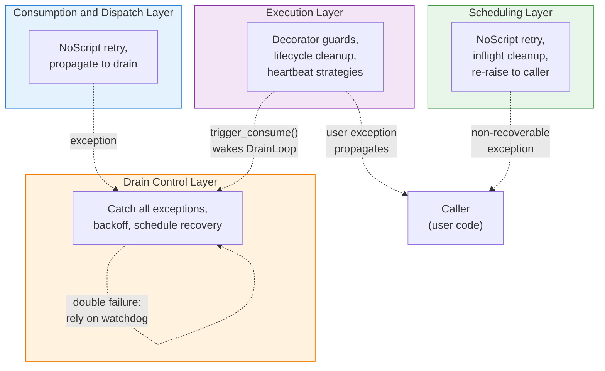
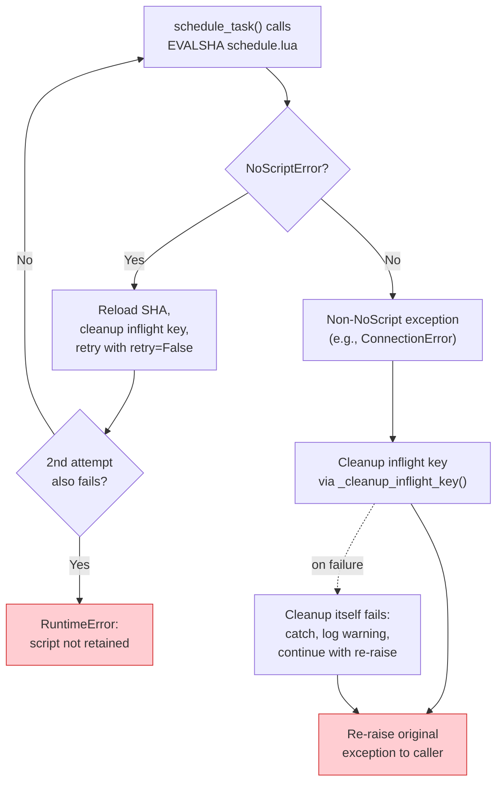
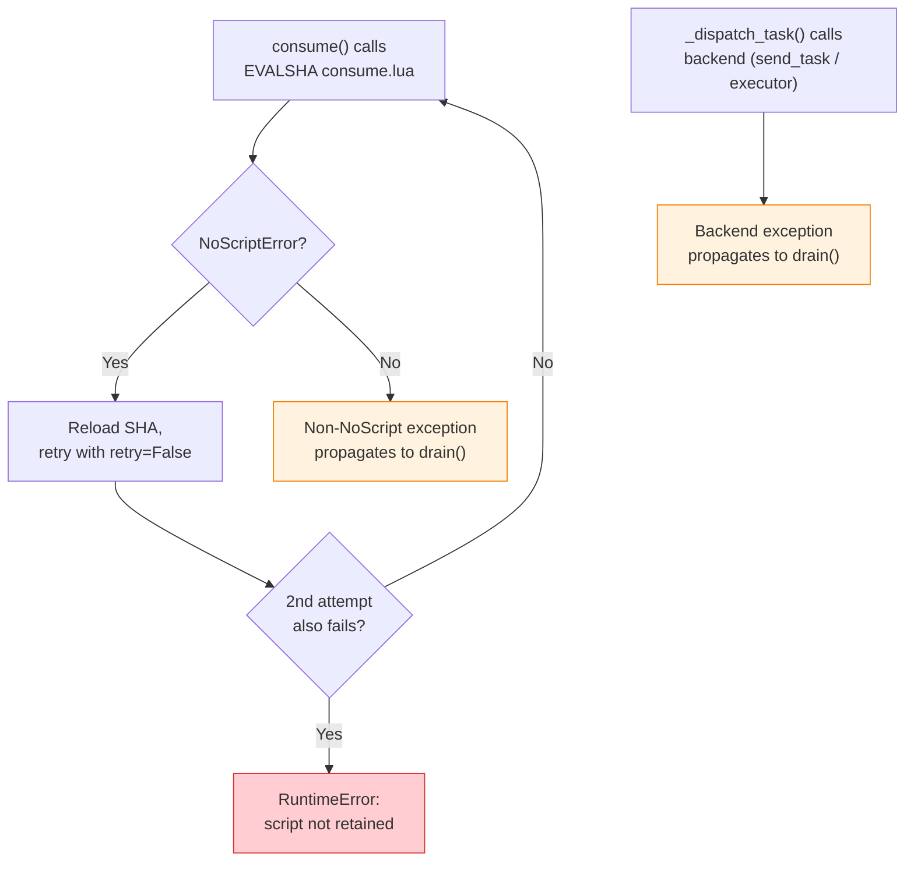
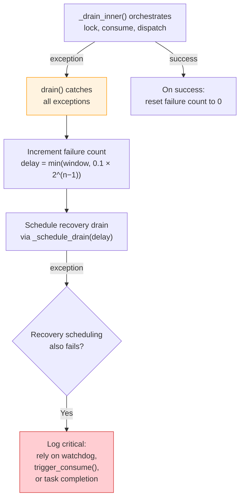
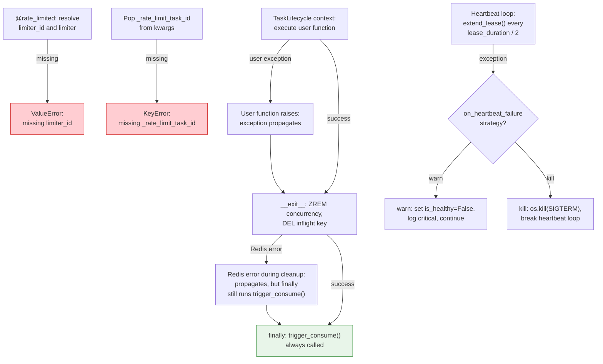

# Error Handling and Propagation

This document serves as a reference for understanding how exceptions propagate through the system layers, where they are caught or retried, and which failure modes are covered by the test suite. It complements the [Task State Diagram](task-states.md), which models nominal and recovery state transitions, by focusing specifically on the exception flow between architectural layers. The [Drain Loop Flow](drain-flow.md) documents the control flow under normal conditions; this document covers what happens when those operations fail. The content is organised as four diagrams: an overview that shows how exceptions propagate across layers, followed by one detailed flowchart per layer. Each detail diagram is accompanied by a test coverage table that maps every decision branch to the test(s) that exercise it.

## Overview

**Legend:**

- *Green subgraph* (Scheduling Layer): exception handling within `schedule_task()`, including the NoScriptError retry pattern and inflight key cleanup on any failure.
- *Blue subgraph* (Consumption and Dispatch Layer): exception handling within `consume()` and `_dispatch_task()`, both of which propagate non-recoverable errors to the drain control layer.
- *Orange subgraph* (Drain Control Layer): the `drain()` method catches all exceptions from `_drain_inner()`, applies exponential backoff, and schedules recovery drains.
- *Purple subgraph* (Execution Layer): the `@rate_limited` decorator, `TaskLifecycle` context manager, and heartbeat loop, which handle task execution errors and concurrency slot cleanup.
- *Dashed arrows* indicate cross-layer exception propagation or asynchronous triggers (e.g., `trigger_consume()` waking the `DrainLoop`).

## Scheduling Layer

The scheduling layer handles exceptions raised during `schedule_task()`. The two primary concerns are recovering from `NoScriptError` (Lua script cache flush) and cleaning up the inflight deduplication key when any exception prevents successful buffering.

**Test coverage:**

| Path | Description | Tested by |
|------|-------------|-----------|
| NoScript → reload → retry succeeds | SHA reload recovers from cache flush | `implementations/test_rate_limiter::test_lua_script_recovery_on_noscript_error` |
| NoScript → reload → retry fails | Permanent failure raises RuntimeError | `implementations/test_rate_limiter::test_lua_script_permanent_failure_raises_error` |
| Non-NoScript → cleanup → re-raise | Inflight key cleaned up before re-raising | `implementations/test_rate_limiter::test_schedule_non_noscript_failure_cleans_inflight_and_reraises` |
| Cleanup itself fails | Suppressed, log warning, continue with re-raise | `implementations/test_internal_helpers::test_cleanup_inflight_key_suppresses_redis_failure` |
| Lua script not found on disk | ImportError at initialization | `implementations/test_internal_helpers::test_load_lua_script_raises_import_error_on_failure` |
| Metrics callback exception during schedule | Does not disrupt scheduling | `implementations/test_metrics_callback::test_callback_exception_does_not_break_schedule` |

### NoScriptError Two-Phase Retry

All four Lua script operations (`schedule_task`, `consume`, `extend_lease`, `get_status`) implement a two-phase retry. The first attempt uses `EVALSHA`; if Redis returns a `NoScriptError` (indicating that the script cache was flushed, e.g., after a `SCRIPT FLUSH` or Redis restart), the method reloads the SHA via `script_load` and retries with `retry=False`. If the second attempt also fails with `NoScriptError`, a `RuntimeError` is raised. This pattern tolerates transient script cache losses while preventing infinite retry loops. The retry logic is identical across all four operations; the scheduling layer is documented here as the canonical example, with cross-references to the consumption layer (below) and the execution layer (for `extend_lease` and `get_status`).

- [limiters.py:643-667](../../src/celery_rate_limiter/core/limiters.py): `schedule_task()` retry logic.
- [limiters.py:753-770](../../src/celery_rate_limiter/core/limiters.py): `consume()` retry logic.
- [limiters.py:822-836](../../src/celery_rate_limiter/core/limiters.py): `extend_lease()` retry logic.
- [limiters.py:1289-1306](../../src/celery_rate_limiter/core/limiters.py): `get_status()` retry logic.

### Inflight Key Cleanup on Any Schedule Failure

`schedule_task()` acquires the inflight key via `SET NX` before calling the Lua script. If the Lua call fails for any reason (NoScriptError, ConnectionError, or any other exception), the inflight key is cleaned up via `_cleanup_inflight_key()` to prevent orphaned deduplication locks that would permanently block resubmission. The cleanup method itself suppresses all exceptions and logs a warning, such that a secondary Redis failure during cleanup does not mask the original error.

- [limiters.py:535-553](../../src/celery_rate_limiter/core/limiters.py): `_cleanup_inflight_key()`.
- [limiters.py:643-672](../../src/celery_rate_limiter/core/limiters.py): cleanup calls on NoScriptError and generic exceptions.

## Consumption and Dispatch Layer

The consumption and dispatch layer handles exceptions raised during `consume()` and `_dispatch_task()`. Non-recoverable exceptions from either operation propagate to the `drain()` method, which catches them and applies exponential backoff (see [Drain Control Layer](#drain-control-layer)).

**Test coverage:**

| Path | Description | Tested by |
|------|-------------|-----------|
| Consume NoScript → reload → retry succeeds | SHA reload during consume | `implementations/test_rate_limiter::test_consume_lua_script_recovery_on_noscript_error` |
| Consume NoScript → retry fails | Permanent failure raises RuntimeError | `implementations/test_rate_limiter::test_consume_lua_script_permanent_failure_raises_error` |
| Consume non-NoScript → propagate | ConnectionError propagates to drain() | `implementations/test_rate_limiter::test_consume_connection_error_propagates` |
| Dispatch Celery failure → propagate | send_task() exception propagates to drain() | `implementations/celery/test_celery_limiter::test_dispatch_task_send_task_failure_propagates` |
| Dispatch ThreadPool failure → propagate | import_string() exception propagates to drain() | `implementations/threadpool/test_threadpool_limiter::test_dispatch_task_import_failure_propagates` |
| Metrics callback exception during consume | Does not disrupt consumption | `implementations/test_metrics_callback::test_callback_exception_does_not_break_consume` |

### Metrics Callback Isolation

`_emit_metric()` wraps the user-provided callback in a `try/except` that catches and logs all exceptions, thereby preventing a buggy callback from disrupting the limiter. This isolation boundary ensures that observability integrations cannot introduce cascading failures into the rate limiting logic.

- [limiters.py:838-859](../../src/celery_rate_limiter/core/limiters.py): `_emit_metric()` with exception suppression.

## Drain Control Layer

The drain control layer wraps `_drain_inner()` in a `try/except` that catches all exceptions from the consumption and dispatch operations. It applies exponential backoff and schedules recovery drains. The [Drain Loop Flow](drain-flow.md) documents the control flow in detail; this section focuses specifically on the error handling aspects.

**Test coverage:**

| Path | Description | Tested by |
|------|-------------|-----------|
| Exception → backoff → schedule recovery | Consume or dispatch exception caught | `implementations/test_drain::test_drain_handles_consume_exception`, `implementations/test_drain::test_drain_handles_dispatch_exception` |
| Escalating backoff | Delay doubles on consecutive failures | `implementations/test_drain::test_drain_backoff_increases_with_consecutive_failures` |
| Double failure → critical log | Recovery scheduling itself fails | `implementations/test_drain::test_drain_handles_double_failure_when_schedule_drain_also_fails` |
| Success → reset counter | Counter resets to 0 | `implementations/test_drain::test_drain_resets_failure_counter_on_success` |

### Exponential Backoff on Failure

`drain()` wraps `_drain_inner()` in a `try/except` that catches all exceptions, increments `_consecutive_drain_failures`, and schedules a recovery drain with `delay = min(window, 0.1 * 2^(n-1))`. The backoff starts at 100ms for the first failure and doubles on each consecutive failure, capped at the window duration. On the first successful drain, the error counter resets to 0. If the recovery scheduling itself also fails, the system logs a critical error and relies on the next external trigger (a `trigger_consume()` call from `schedule_task()` or `TaskLifecycle.__exit__()`, or a watchdog timeout) to resume the drain loop.

- [limiters.py:1008-1032](../../src/celery_rate_limiter/core/limiters.py): drain exception handling and backoff calculation.

## Execution Layer

The execution layer encompasses the `@rate_limited` decorator, the `TaskLifecycle` context manager, and the heartbeat loop. These components handle task execution errors, concurrency slot cleanup, and lease renewal failures.

**Test coverage:**

| Path | Description | Tested by |
|------|-------------|-----------|
| Missing limiter_id → ValueError | Decorator rejects missing limiter_id | `implementations/test_decorator::test_decorator_raises_value_error_when_limiter_id_missing` |
| Missing _rate_limit_task_id → KeyError | Decorator rejects missing task_id | `implementations/test_decorator::test_decorator_raises_when_task_id_missing` |
| User exception → cleanup → trigger | Exception propagates; cleanup and trigger still fire | `implementations/test_decorator::test_decorator_propagates_wrapped_function_exception` |
| Normal → cleanup → trigger | Lifecycle cleans up and triggers next drain | `contracts/test_task_lifecycle::test_lifecycle_cleans_up_on_exception` |
| Redis error during cleanup → trigger still fires | trigger_consume() fires in finally block | `implementations/test_task_lifecycle::test_lifecycle_handles_redis_failure_during_cleanup` |
| Heartbeat warn mode | is_healthy = False, log critical, continue | `implementations/test_task_lifecycle::test_heartbeat_loop_flags_unhealthy_on_failure_warn_mode` |
| Heartbeat kill mode | os.kill(SIGTERM), break loop | `implementations/test_task_lifecycle::test_heartbeat_loop_terminates_worker_on_failure_kill_mode` |
| extend_lease NoScript recovery | SHA reload during heartbeat | `implementations/test_task_lifecycle::test_extend_lease_recovery_on_noscript_error` |
| extend_lease permanent failure | RuntimeError propagates to heartbeat | `implementations/test_task_lifecycle::test_extend_lease_permanent_failure_raises_error` |
| extend_lease unknown task | KeyError for unknown task_id | `implementations/test_task_lifecycle::test_extend_lease_raises_key_error_for_unknown_task` |

### TaskLifecycle Finally Block

`TaskLifecycle.__exit__()` performs cleanup (ZREM on the concurrency set, DEL on the inflight key) in a `try` block, with `trigger_consume()` in the `finally` block. This guarantees that the feedback loop continues even if the Redis cleanup operations fail, such that a freed concurrency slot is always followed by a consumption attempt.

- [limiters.py:211-241](../../src/celery_rate_limiter/core/limiters.py): `__exit__()` with try/finally.

### Heartbeat Failure Strategies

The heartbeat loop catches all exceptions from `extend_lease()`. In `"warn"` mode, it sets `is_healthy = False` and logs a critical message, allowing the task to continue running at the risk of the concurrency slot lease expiring. In `"kill"` mode, it sends `SIGTERM` to the worker process, ensuring that the task is terminated and the concurrency slot self-heals via lease expiry. The choice between strategies is configured per `TaskLifecycle` instance.

- [limiters.py:157-190](../../src/celery_rate_limiter/core/limiters.py): `_heartbeat_loop()` exception handling.

## Failure Mode Traceability

The following table enumerates every identified failure mode, its handling strategy, and the test that validates it. Each failure mode is also visualised in the layer diagrams above; this table serves as a flat, searchable reference. Rows marked **Yes** in the Gap column represent failure paths that lack dedicated test coverage.

| # | Failure Mode | Source | Exception Type | Handling Strategy | Test Coverage | Gap? |
|---|---|---|---|---|---|---|
| 1 | Lua script cache flushed during `schedule_task()` | `schedule_task()` | `NoScriptError` | Reload SHA, retry once; `RuntimeError` on 2nd failure | `implementations/test_rate_limiter::test_lua_script_recovery_on_noscript_error`, `test_lua_script_permanent_failure_raises_error` | No |
| 2 | Lua script cache flushed during `consume()` | `consume()` | `NoScriptError` | Reload SHA, retry once; `RuntimeError` on 2nd failure | `implementations/test_rate_limiter::test_consume_lua_script_recovery_on_noscript_error`, `test_consume_lua_script_permanent_failure_raises_error` | No |
| 3 | Lua script cache flushed during `extend_lease()` | `extend_lease()` | `NoScriptError` | Reload SHA, retry once; `RuntimeError` on 2nd failure | `implementations/test_task_lifecycle::test_extend_lease_recovery_on_noscript_error`, `test_extend_lease_permanent_failure_raises_error` | No |
| 4 | Lua script cache flushed during `get_status()` | `get_status()` | `NoScriptError` | Reload SHA, retry once; `RuntimeError` on 2nd failure | `implementations/test_get_status::test_get_status_recovery_on_noscript_error`, `test_get_status_permanent_failure_raises_error` | No |
| 5 | Redis unreachable during `schedule_task()` | `schedule_task()` | `ConnectionError` | Cleanup inflight key, re-raise | `implementations/test_rate_limiter::test_schedule_non_noscript_failure_cleans_inflight_and_reraises` | No |
| 6 | Redis unreachable during `consume()` | `consume()` | `ConnectionError` | Propagates to `drain()` backoff | `implementations/test_rate_limiter::test_consume_connection_error_propagates` | No |
| 7 | Redis unreachable during `get_status()` | `get_status()` | `ConnectionError` | Propagates to caller (not caught) | `implementations/test_get_status::test_get_status_connection_error_propagates` | No |
| 8 | Redis unreachable during `extend_lease()` | `extend_lease()` | `ConnectionError` | Propagates to heartbeat loop; handled by warn/kill strategy | Indirectly via heartbeat tests with generic `Exception` mock | Partial |
| 9 | Redis unreachable during `TaskLifecycle.__exit__()` cleanup | `TaskLifecycle.__exit__()` | `Exception` | Propagates, but `trigger_consume()` still fires in `finally` | `contracts/test_task_lifecycle::test_lifecycle_cleans_up_on_exception` | No |
| 10 | Lease renewal for unknown task | `extend_lease()` | `KeyError` | Propagates to heartbeat loop | `implementations/test_task_lifecycle::test_extend_lease_raises_key_error_for_unknown_task` | No |
| 11 | Heartbeat failure in "warn" mode | `_heartbeat_loop()` | Any `Exception` | `is_healthy = False`, log critical | `implementations/test_task_lifecycle::test_heartbeat_loop_flags_unhealthy_on_failure_warn_mode` | No |
| 12 | Heartbeat failure in "kill" mode | `_heartbeat_loop()` | Any `Exception` | `os.kill(SIGTERM)`, break loop | `implementations/test_task_lifecycle::test_heartbeat_loop_terminates_worker_on_failure_kill_mode` | No |
| 13 | `drain()` inner failure (any exception) | `drain()` | Any `Exception` | Increment failure counter, schedule recovery with backoff | `implementations/test_drain::test_drain_handles_consume_exception`, `test_drain_handles_dispatch_exception` | No |
| 14 | Recovery scheduling also fails | `drain()` | Any `Exception` | Log critical; rely on watchdog or external trigger | `implementations/test_drain::test_drain_handles_double_failure_when_schedule_drain_also_fails` | No |
| 15 | Missing `limiter_id` in decorator | `@rate_limited` | `ValueError` | Propagates to caller | `implementations/test_decorator::test_decorator_raises_value_error_when_limiter_id_missing` | No |
| 16 | Missing `_rate_limit_task_id` in decorator | `@rate_limited` | `KeyError` | Propagates to caller | `implementations/test_decorator::test_decorator_raises_when_task_id_missing` | No |
| 17 | User function raises exception inside `@rate_limited` | `@rate_limited` wrapper | Any `Exception` | Propagates; `TaskLifecycle.__exit__()` cleanup still runs | `implementations/test_decorator::test_decorator_propagates_wrapped_function_exception` | No |
| 18 | `configure()` not called before `create()`/`get()` | Class API | `RuntimeError` | Propagates to caller | `implementations/test_rate_limiter_class_api::test_create_without_configure_raises` | No |
| 19 | Limiter not found in cache or Redis | `get()` | `ValueError` | Propagates to caller | `implementations/test_rate_limiter_class_api::test_get_nonexistent_limiter_raises_value_error` | No |
| 20 | Duplicate limiter creation without override | `create()` | `ValueError` | Propagates to caller | `implementations/test_rate_limiter_class_api::test_create_duplicate_without_override_raises` | No |
| 21 | Direct constructor invocation (bypass class API) | `__init__()` | `RuntimeError` | Propagates to caller | `implementations/test_rate_limiter_class_api::test_direct_construction_raises_runtime_error` | No |
| 22 | Corrupted JSON in persisted config | `refresh_config()` | `JSONDecodeError` | Catch, log warning, return `False` | `implementations/test_rate_limiter_class_api::test_refresh_config_handles_corrupted_redis_data` | No |
| 23 | Lua script not found on disk | `_load_lua_script()` | `ImportError` | Propagates (fatal at initialization) | `implementations/test_internal_helpers::test_load_lua_script_raises_import_error_on_failure` | No |
| 24 | Inflight key cleanup fails during scheduling error | `_cleanup_inflight_key()` | Any `Exception` | Suppressed, log warning | `implementations/test_internal_helpers::test_cleanup_inflight_key_suppresses_redis_failure` | No |
| 25 | Celery `send_task()` fails during dispatch | `_dispatch_task()` (Celery) | `Exception` | Propagates to `drain()` backoff | `implementations/celery/test_celery_limiter::test_dispatch_task_send_task_failure_propagates` | No |
| 26 | `import_string()` fails during dispatch | `_dispatch_task()` (ThreadPool) | `ModuleNotFoundError` | Propagates to `drain()` backoff | `implementations/threadpool/test_threadpool_limiter::test_dispatch_task_import_failure_propagates` | No |
| 27 | Metrics callback raises exception | `_emit_metric()` | Any `Exception` | Caught, logged, does not disrupt limiter | `implementations/test_metrics_callback::test_callback_exception_does_not_break_consume` | No |
| 28 | Missing backend context during `configure()` | `_configure_backend()` | `RuntimeError` | Propagates to caller | `test_rate_limiter_class_api` (per backend) | No |

## References

- [limiters.py](../../src/celery_rate_limiter/core/limiters.py): core implementation containing all error handling patterns.
- [decorators.py](../../src/celery_rate_limiter/core/decorators.py): `@rate_limited` decorator error paths.
- [celery/limiter.py](../../src/celery_rate_limiter/backends/celery/limiter.py): Celery backend dispatch (`send_task`) error propagation.
- [threading/limiter.py](../../src/celery_rate_limiter/backends/threading/limiter.py): ThreadPool backend dispatch (`import_string`) error propagation.
- [Drain Loop Flow](drain-flow.md): the three-layer drain control loop and feedback entry points.
- [Task State Diagram](task-states.md): all possible task states, including crash recovery mechanisms.
