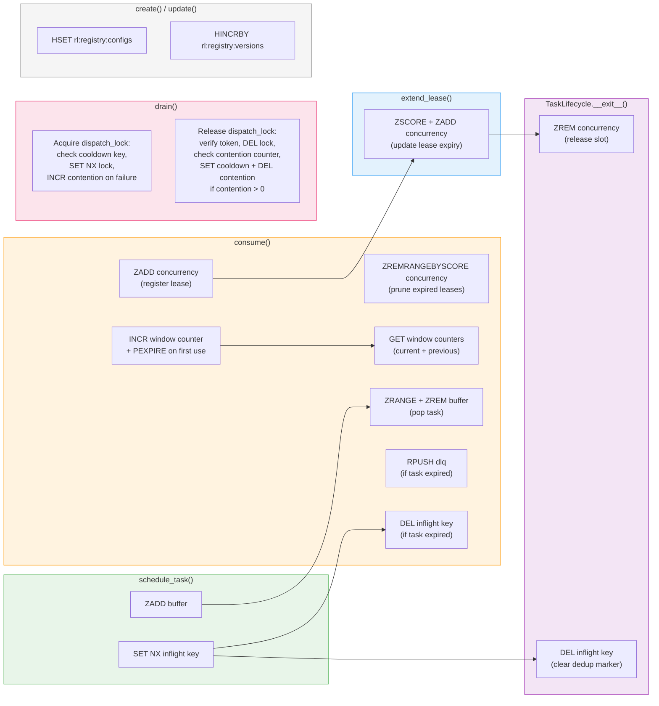

# Redis Key Map

All rate limiting state is persisted in Redis and mutated exclusively through atomic Lua scripts. Each limiter instance namespaces its keys with a unique identifier, such that multiple independent limiters can coexist on the same Redis server without interference. This document provides a comprehensive reference of every key pattern, its data type, purpose, and lifecycle.

## Key Reference

| Key Pattern | Type | Purpose | Creator | Reader | TTL |
|---|---|---|---|---|---|
| `{id}:{window_start_ms}` | STRING | Fixed window counter. The suffix is the window start timestamp in milliseconds, computed as `floor(now_ms / window_size_ms) * window_size_ms`. Each counter tracks the number of tokens consumed within a single fixed window period. | `consume.lua` via `INCR` | `consume.lua` and `health.lua` via `GET` | `2 * window_ms + 10000ms`, set via `PEXPIRE` on first increment |
| `{id}:buffer` | ZSET | Priority task queue. The score is the task priority and the member is a JSON-serialized task payload (including injected metadata such as `__meta_arrived_at` and optionally `__meta_max_age`). | `schedule.lua` via `ZADD` | `consume.lua` via `ZRANGE` and `ZREM`; `health.lua` via `ZCARD` | None |
| `{id}:concurrency` | ZSET | Active task lease set. The score is the lease expiry timestamp (Unix seconds) and the member is the task identifier. Expired leases are pruned automatically at the start of every `consume()` call via `ZREMRANGEBYSCORE`. | `consume.lua` via `ZADD` | `consume.lua` via `ZCARD` and `ZREMRANGEBYSCORE`; `health.lua` via `ZCARD`; `renew.lua` via `ZSCORE` and `ZADD` | Self-healing; expired entries are removed by `ZREMRANGEBYSCORE` |
| `{id}:inflight:{task_id}` | STRING | Deduplication marker that prevents the same task from being scheduled more than once while it is in flight. The value is the string `"1"`. | `limiters.py` (`schedule_task`) via `SET NX EX` | `consume.lua` via `DEL` (on task expiry); `TaskLifecycle.__exit__()` via `DEL` | `ceil(max(1, max_age) + max(1, lease_duration) + max(1, window))` seconds |
| `{id}:dlq` | LIST | Dead letter queue for tasks that have exceeded their maximum age while waiting in the buffer. Expired tasks are appended to this list during consumption. | `consume.lua` via `RPUSH` | User code (manual inspection) | None |
| `{id}:dispatch_lock` | STRING | Drain mutex that ensures only one drainer operates at any given time. The value is a UUID token that identifies the lock holder; the compare-and-delete release script prevents the inadvertent deletion of locks created after a timeout. When contention-aware fairness is enabled, acquisition and release are performed via dedicated Lua scripts that additionally manage the cooldown and contention keys. | `limiters.py` (`DistributedLock.__enter__`) via `SET NX PX` (simple mode) or `_ACQUIRE_SCRIPT` (fairness mode) | `DistributedLock.__exit__()` via `_SIMPLE_RELEASE_SCRIPT` (simple mode) or `_RELEASE_SCRIPT` (fairness mode); `get_status()` via `EXISTS` | 5000ms (configurable via `timeout_ms` parameter) |
| `{id}:dispatch_lock:cd:{worker_id}` | STRING | Per-worker cooldown marker. When contention is detected (i.e., other workers attempted to acquire the lock while it was held), the releasing worker sets this key to block its own re-acquisition for one token interval, giving competing workers a fair opportunity. The value is the string `"1"`. | `DistributedLock.__exit__()` via `_RELEASE_SCRIPT` (`SET PX`) | `DistributedLock.__enter__()` via `_ACQUIRE_SCRIPT` (`EXISTS`) | `min(window_ms / limit, 1000)` ms |
| `{id}:dispatch_lock:contention` | STRING | Shared contention counter. Incremented by workers that fail to acquire the dispatch lock (because another worker holds it), allowing the lock holder to detect competition upon release. When the holder releases and finds a contention value greater than zero, it sets its own cooldown key and resets the counter. | `DistributedLock.__enter__()` via `_ACQUIRE_SCRIPT` (`INCR`) | `DistributedLock.__exit__()` via `_RELEASE_SCRIPT` (`GET`, `DEL`) | `timeout_ms` (same as the dispatch lock; set via `PEXPIRE`) |
| `rl:registry:configs` | HASH | Configuration persistence for managed limiter instances. Each field is a limiter identifier and the corresponding value is a JSON-serialized configuration object containing `limit`, `window`, `max_concurrency`, `max_age`, and `lease_duration`. | `AbstractRedisManagedRateLimiter._persist_config()` via `HSET` | `AbstractRedisManagedRateLimiter.get()` and `refresh_config()` via `HGET` | None |
| `rl:registry:versions` | HASH | Configuration version tracking for managed limiter instances. Each field is a limiter identifier and the corresponding value is a monotonically increasing integer that is incremented upon every configuration update. Workers compare the remote version against their local version to detect configuration changes. | `AbstractRedisManagedRateLimiter._persist_config()` via `HINCRBY` | `AbstractRedisManagedRateLimiter.get()` and `refresh_config()` via `HGET` | None |

## Key Lifecycle

The following diagram illustrates how each key is created, read, updated, and deleted throughout the lifecycle of a task. Solid arrows represent write operations, and dashed arrows represent read operations.



## Key Namespacing

All per-limiter keys are prefixed with the limiter's unique identifier (`{id}:`), as constructed in the `AbstractDistributedRateLimiter.__init__()` method within [`limiters.py`](../../src/celery_rate_limiter/core/limiters.py). The key assignments are as follows:

```python
self.buffer_key = f"{self.id}:buffer"
self.concurrency_key = f"{self.id}:concurrency"
self.lock_key = f"{self.id}:dispatch_lock"
self.dlq_key = f"{self.id}:dlq"
self.contention_key = f"{self.id}:dispatch_lock:contention"
```

The inflight key is constructed dynamically for each task via the `get_inflight_key()` method:

```python
def get_inflight_key(self, task_id: str) -> str:
    return f"{self.id}:inflight:{task_id}"
```

The per-worker cooldown key is constructed within `DistributedLock.__init__()` by appending the worker identifier:

```python
self._cooldown_key = f"{lock_key}:cd:{worker_id}"
```

Window counter keys are constructed within `consume.lua` and `health.lua` by appending the window start timestamp to the base key:

```lua
local current_key = base_key .. ':' .. current_window_start
local previous_key = base_key .. ':' .. previous_window_start
```

This namespacing convention ensures that multiple independent limiter instances can coexist on the same Redis server without key collisions. For example, a limiter with `id="rate_limit:api_v1"` and a limiter with `id="rate_limit:api_v2"` will produce entirely disjoint key sets, even when connected to the same Redis instance. The two global registry keys (`rl:registry:configs` and `rl:registry:versions`) are shared across all managed limiter instances, with each limiter occupying a distinct hash field keyed by its identifier.

## Window Counter TTL Strategy

The TTL for fixed window counters is set to `2 * window_ms + 10000ms` (i.e., two full window periods plus a ten-second buffer), and it is applied via `PEXPIRE` on the first increment of each window counter. This TTL strategy exists because the sliding window counter algorithm requires access to *both* the current and previous window counters in order to compute the weighted estimate of the request rate. As such, the previous window counter must survive long enough to be read during the entirety of the subsequent window period. A TTL of exactly two windows would be sufficient under ideal conditions; however, the additional ten-second buffer accounts for clock skew between the Redis server and application servers, as well as minor processing delays that may cause a read to occur slightly after the theoretical window boundary. Once the TTL expires, the counter is automatically deleted by Redis, thereby preventing unbounded key accumulation. For a detailed explanation of the sliding window counter algorithm and its weighting formula, refer to [Sliding Window Algorithm](sliding-window.md).

## Self-Healing Concurrency Leases

At the start of every `consume()` invocation, the consume Lua script executes a self-healing consistency check:

```lua
redis.call('ZREMRANGEBYSCORE', concurrency_key, "-inf", timestamp - 1)
```

This operation removes all entries from the concurrency ZSET whose scores (i.e., lease expiry timestamps) are less than the current Redis server timestamp. The mechanism is designed to handle worker failures gracefully: when a worker process crashes or becomes unresponsive, its heartbeat thread ceases to renew the lease, and the lease expiry timestamp in the ZSET falls behind the current time. On the next consumption attempt by *any* worker in the system, the expired entry is automatically pruned, thereby freeing the concurrency slot for reuse. This approach makes the system resilient to worker failures without requiring external health monitoring infrastructure, a dedicated cleanup daemon, or manual intervention. The self-healing property is a direct consequence of the lease-based concurrency model, in which each active task must continuously renew its lease (via the `TaskLifecycle` heartbeat thread and `renew.lua`) to retain its concurrency slot.

## Inflight Key TTL Formula

The TTL for inflight deduplication keys is computed in the `_get_inflight_ttl()` method within [`limiters.py`](../../src/celery_rate_limiter/core/limiters.py) as follows:

```python
ttl_seconds = (
    max(1.0, float(effective_max_age))
    + max(1.0, float(self.lease_duration))
    + max(1.0, float(self.window))
)
return int(math.ceil(ttl_seconds))
```

Each component of the formula serves a distinct purpose:

- **`max(1, max_age)`** covers the *buffering period*, i.e., the maximum duration a task may reside in the buffer before it is either consumed or moved to the dead letter queue. This ensures that the deduplication marker persists for at least as long as the task could be waiting in the queue.
- **`max(1, lease_duration)`** covers the *execution period*, i.e., the maximum duration of a single concurrency lease. This ensures that the marker remains active while the task is being executed by a worker.
- **`max(1, window)`** covers potential *cleanup delay*, i.e., the time required for the `TaskLifecycle.__exit__()` method to delete the inflight key after task completion. Under adverse conditions (e.g., a window reset occurring simultaneously with task completion), this additional buffer prevents premature key expiry.

The `max(1, ...)` guard on each component ensures that the TTL is always at least three seconds, thereby preventing a zero-length TTL in the event that any parameter is set to zero. The final result is rounded up to the nearest integer via `math.ceil()`, as the Redis `EX` option requires an integer number of seconds.

## References

- [consume.lua](../../src/celery_rate_limiter/lua/consume.lua): atomic consumption script (window check, buffer pop, lease registration).
- [schedule.lua](../../src/celery_rate_limiter/lua/schedule.lua): task scheduling script (buffer insertion).
- [renew.lua](../../src/celery_rate_limiter/lua/renew.lua): lease renewal script (concurrency set update).
- [health.lua](../../src/celery_rate_limiter/lua/health.lua): health check script (status reads).
- [limiters.py](../../src/celery_rate_limiter/core/limiters.py): core implementation (key construction, TTL calculations, dispatch lock).
- [Sliding Window Algorithm](sliding-window.md): visual explanation of the window counter algorithm and TTL rationale.
