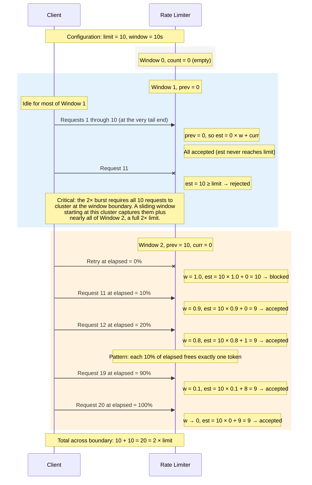

# Sliding Window Algorithm

The sliding window counter algorithm is the mechanism by which the rate limiter estimates the number of requests that have occurred within a rolling time window. Rather than maintaining a single counter that resets abruptly at fixed intervals, the algorithm combines the counts from two adjacent fixed windows using a time-based weight. As such, it provides a smooth approximation of the true request rate, eliminating the boundary problem that plagues naive fixed window counters. The core idea is straightforward: the further the current moment is from the previous window, the less that window's count contributes to the estimate. This approach is both memory-efficient (requiring only two integer counters) and computationally inexpensive (a single weighted sum), making it well-suited for evaluation inside an atomic Redis Lua script.

## Timeline Visualization

The following diagram illustrates how the sliding window overlaps with two adjacent fixed windows. The key insight is that the sliding window always spans exactly one `window_size` duration, but it does not align with the fixed window boundaries. Instead, it straddles the boundary between the previous and current fixed windows, and the proportion of overlap determines how much weight the previous window receives.

```mermaid
%%{init: {"theme": "default", "themeVariables": {"lineColor": "#6e7781"}}}%%
gantt
    title Sliding Window Example (window = 10s, now at t = 14s)
    dateFormat x
    axisFormat %Ss

    section Fixed Windows
    Previous Window (count = 7)         :prev, 0, 10000
    Current Window (count = 3)          :curr, 10000, 20000

    section ⠀
    ⠀ :done, 0, 0

    section Sliding Window (t = 4s → t = 14s)
    Sliding Window                       :sw, 4000, 14000
    Previous window overlap (6s) :crit, 4000, 10000
    Current window overlap (4s)  :active, 10000, 14000
```



**Reading the diagram:** the sliding window (grey bar) straddles the boundary between the two fixed windows (top two bars). The two bars beneath it decompose the sliding window into its overlap with each fixed window:

- **Previous window overlap** *(red, 6s)*: the sliding window extends 6 seconds into the previous fixed window. This overlap determines the weight: `weight = 6 / 10 = 0.6`. The previous window's count of 7 is scaled accordingly: `7 × 0.6 = 4.2`.
- **Current window overlap** *(blue, 4s)*: the sliding window extends 4 seconds into the current fixed window. This overlap is the elapsed time since the current window started: `elapsed = 4s`. The current window's count of 3 is included in full.
- **Estimate**: `estimated = 3 + (7 × 0.6) = 7.2`. If the limit were 8, this request would be permitted; if the limit were 7, it would be denied.

## The Weight Formula

The weight determines the fraction of the previous window's count that is included in the estimate. It is computed as follows:

```
weight = (window_size - elapsed) / window_size
```

Here, `elapsed` is the time that has passed since the start of the current fixed window, i.e., `now - current_window_start`. At the very beginning of a new fixed window (`elapsed = 0`), the entire previous window falls within the sliding window, and the weight is `1.0`. As time progresses through the current window, the overlap with the previous window shrinks, and the weight decays linearly toward `0.0`.

| Elapsed (% of window) | Weight | Interpretation |
|---|---|---|
| 0% | 1.00 | Full previous window counts |
| 25% | 0.75 | 75% of previous window counts |
| 50% | 0.50 | Half of previous window counts |
| 75% | 0.25 | 25% of previous window counts |
| 100% | 0.00 | Previous window fully decayed |

## The Estimate Formula

The estimated request count for the sliding window is computed as:

```
estimated = current_count + (previous_count * weight)
```

This is the weighted sum that the rate limiter evaluates on every consume attempt. If `estimated < limit`, the request is permitted; otherwise, it is denied.

The authoritative implementation resides in the Lua script that runs atomically on the Redis server:

```lua
-- From consume.lua (lines 44-49)
-- Approximate the total count using a weighted combination of the previous and current windows.
-- Estimated_Rate = (Previous_Window_Count * Weight) + Current_Window_Count
-- Weight = (window_size_ms - Time_Elapsed_In_Current_Window) / window_size_ms
local time_passed_in_current = now_ms - current_window_start
local weight = (window_size_ms - time_passed_in_current) / window_size_ms
local estimated_count = current_count + (previous_count * weight)
```

A pure Python reference implementation mirrors this logic for use in deterministic testing:

```python
# From tests/algorithms/sliding_window_counter.py
def sliding_window_estimate(
    previous_count: int,
    current_count: int,
    window_ms: int,
    elapsed_ms: int,
) -> float:
    weight = (window_ms - elapsed_ms) / window_ms
    return current_count + (previous_count * weight)
```

The two implementations are intentionally identical in structure, such that the property-based tests that run against the Python version also validate the correctness of the Lua logic.

## Comparison with Alternative Approaches

### Fixed Window Counter

A fixed window counter divides time into non-overlapping intervals and maintains a single counter per interval. The counter increments on each request and resets to zero when the window expires. The fundamental problem with this approach is the *boundary burst*: a client can issue `limit` requests at the very end of one window and another `limit` requests at the very beginning of the next window, resulting in `2 * limit` requests within a time span shorter than a single window. The sliding window counter solves this by blending the counts from adjacent windows, such that requests near the boundary of the previous window still contribute to the current estimate proportionally.

### Sliding Window Log

A sliding window log tracks the timestamp of every individual request and counts only those that fall within the most recent `window_size` duration. This approach is exact rather than approximate, but it requires storing every request timestamp, resulting in O(n) memory usage where n is the number of requests per window. Moreover, the count operation requires scanning and pruning the log on each request. The sliding window counter, by contrast, uses only two integer counters (O(1) memory) and computes the estimate with a single arithmetic expression. The trade-off is that the counter approach is an approximation, but as the property tests demonstrate, the approximation is tightly bounded.

## The 2x Burst Bound

The sliding window counter is an approximation, and as such, it can allow more than `limit` requests in certain edge cases. The worst case is the *2x burst bound*, which occurs when the previous window was empty and the current window is at capacity at the moment a new fixed window begins.

The following Gantt chart illustrates why the burst occurs. With `limit = 10` and `window = 10s`, Window 0 is empty, all 10 requests in Window 1 arrive in a narrow cluster at the tail end, and 10 more requests are admitted across Window 2 as the weight decays. The sliding window bar at the bottom shows that all 20 requests (2x limit) fall within a span of exactly one window.

```mermaid
%%{init: {"theme": "default", "themeVariables": {"lineColor": "#6e7781"}}}%%
gantt
    title 2× Burst Scenario (limit = 10, window = 10s)
    dateFormat x
    axisFormat %Ss

    section Fixed Windows
    Window 0: 0 requests      :done, 0, 10000
    Window 1: 10 requests     :w1, 10000, 20000
    Window 2: 10 requests     :w2, 20000, 30000

    section ⠀
    ⠀ :done, 0, 0

    section Request Arrival
    10 reqs at last instant  :crit, 19500, 20000
    10 reqs evenly spread    :active, 20000, 30000

    section ⠀⠀
    ⠀⠀ :done, 0, 0

    section Sliding Window
    20 requests in 1 window (2× limit) :sw, 19500, 29500
```



**Reading the diagram:** the red bar shows 10 requests arriving at the very last instant of Window 1; the blue bar shows 10 more requests spread across Window 2. The grey bar at the bottom captures both clusters within a span of exactly one window. Despite a configured limit of 10 requests per window, 20 requests were admitted, twice the limit. This is the theoretical worst case, and it occurs precisely because Window 0 was empty: the algorithm saw no previous-window count to penalise Window 1, which in turn allowed a full window's worth of requests to accumulate unweighted.

The sequence diagram below traces the same scenario step by step, showing the weight decay and estimate calculation at each decision point.



The mathematical guarantee is:

```
estimated = current_count + (previous_count * weight)
```

Given that `0 <= weight <= 1`, the maximum value of the estimate is `current_count + previous_count`. Since the algorithm only permits requests when `estimated < limit`, both `current_count` and `previous_count` are individually bounded by `limit`. As such, the theoretical maximum number of requests across any two adjacent windows is `2 * limit`.

This bound is formally verified by property-based tests in [test_sliding_window_counter.py](../../tests/properties/test_sliding_window_counter.py). In particular, the `test_estimate_is_bounded` test uses Hypothesis to verify that for any valid combination of `previous_count`, `current_count`, `window_ms`, and `elapsed_ms`, the estimate always satisfies:

```
current_count <= estimated <= previous_count + current_count
```

## Compensating Burst After a Processing Hiccup

The 2x burst bound describes the theoretical worst case, but a more subtle variant arises during steady-state operation. If a scheduling hiccup (e.g., a garbage collection pause, a network stall, or OS-level scheduling jitter) temporarily prevents the system from consuming tasks, the affected window becomes *under-saturated*: its counter ends up lower than the limit. When processing resumes in the next window, the low previous-window count translates to a low weighted contribution, which frees additional tokens beyond the normal steady-state rate. The result is a *compensating burst*, a cluster of requests that arrives faster than the configured rate, even though each individual fixed window counter never exceeds the limit.

```mermaid
%%{init: {"theme": "default", "themeVariables": {"lineColor": "#6e7781"}}}%%
gantt
    title Compensating Burst After Hiccup (limit = 10, window = 10s)
    dateFormat x
    axisFormat %Ss

    section Fixed Windows
    Window N: 10 reqs (steady)        :wn, 0, 10000
    Window N+1: 6 reqs (under-sat.)   :wn1, 10000, 20000
    Window N+2: 10 reqs (recovery)    :wn2, 20000, 30000

    section ⠀
    ⠀ :done, 0, 0

    section Request Arrival
    Steady flow (10 reqs)            :active, 0, 10000
    Normal flow (4 reqs)             :active, 10000, 14000
    Hiccup, no processing             :done, 14000, 18000
    Trickle resume (2 reqs)          :active, 18000, 20000
    Compensating burst (4 reqs in <1s) :crit, 20000, 21000
    Normal flow resumes (6 reqs)     :active, 21000, 30000

    section ⠀⠀
    ⠀⠀ :done, 0, 0

    section Measurement (19s–29s)
    12 reqs observed (limit = 10) :crit, 19000, 29000
```



**Reading the diagram:** Window N is at steady state (10 requests evenly spread). Partway through Window N+1, a processing hiccup pauses consumption for 4 seconds (grey gap). Only 6 of the expected 10 requests are consumed, leaving the window under-saturated. When Window N+2 begins, the previous-window count is only 6 rather than the expected 10, so the weighted estimate at the start of the window is `6 × 1.0 + 0 = 6`, well below the limit of 10. The algorithm immediately admits 4 burst requests (red bar) before the estimate catches up to the limit. The red bar at the bottom shows that a 10-second measurement window placed across the hiccup boundary captures 12 requests (2 from the trickle resume plus all 10 from Window N+2), exceeding the configured limit of 10.

Crucially, no individual fixed window counter ever exceeds the limit: Window N+1 has 6 and Window N+2 has 10. The per-fixed-window invariant holds. It is only the *sliding measurement window*, a real-time span that does not align with the fixed window boundaries, that observes the elevated rate. This distinction is why the property was difficult to assert reliably in integration tests, and why the corresponding parameterised test was [removed](https://github.com/melroy999/redis-rate-limiter/commit/0b7b138) in favour of the provable per-fixed-window and 2x burst bounds.

## Window Counter Expiry

Each fixed window counter is stored in Redis as a simple key-value pair, where the key encodes the window start timestamp (e.g., `rate_limit:api_global:1707264000000`). These keys must persist long enough for the subsequent window's weight calculation to reference them, but they should not accumulate indefinitely.

The TTL strategy is as follows: when a window counter is first created (i.e., when `current_count` transitions from 0 to 1), the key is assigned an expiration of `2 * window_size + 10 seconds`. This duration ensures that the key survives for the entirety of the current window, remains available throughout the next window (during which it serves as the "previous" window for the weight calculation), and includes a 10-second safety margin to account for clock drift and processing delays. The relevant Lua logic is:

```lua
-- From consume.lua (lines 96-98)
if current_count == 0 then
    redis.call('PEXPIRE', current_key, 2 * window_size_ms + 10000)
end
```

For the full inventory of Redis keys, their data types, and their TTL strategies, see [Redis Key Map](redis-keys.md).

## References

- [consume.lua](../../src/redis_rate_limiter/lua/consume.lua): the Lua script that implements the sliding window check.
- [sliding_window_counter.py](../../tests/algorithms/sliding_window_counter.py): the Python reference implementation.
- [test_sliding_window_counter.py](../../tests/properties/test_sliding_window_counter.py): property-based tests that verify the 2x burst bound.
- [test_token_recovery.py](../../tests/properties/test_token_recovery.py): property-based tests that verify the token recovery delay calculation invariants.
- [Redis Key Map](redis-keys.md): comprehensive reference of all Redis keys, including window counter TTLs.
