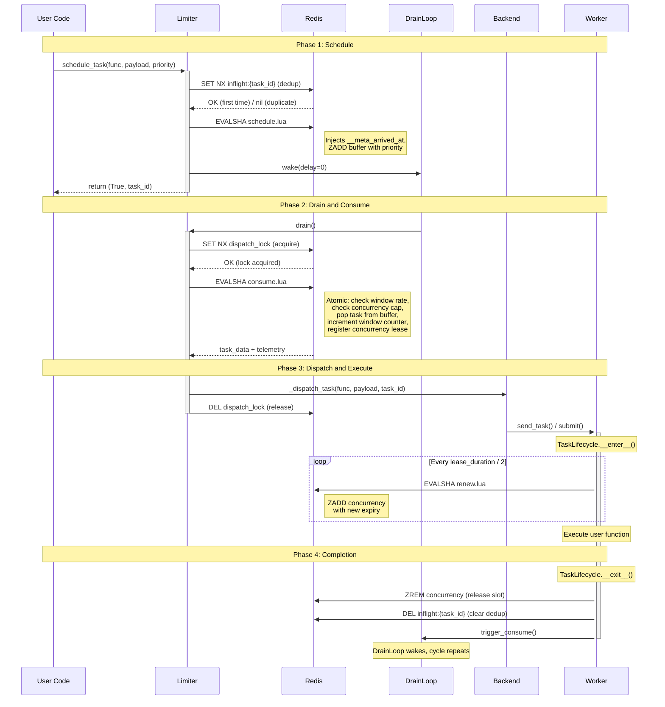

# Task Lifecycle Sequence

The sequence diagram traces the flow of a single task from the moment it is scheduled to the moment its execution completes. The diagram is divided into four phases, namely the *scheduling* phase, the *drain and consume* phase, the *dispatch and execution* phase and the *completion* phase. It should be noted that the diagram depicts the nominal flow exclusively. The handling of error conditions, such as script cache misses, lock contention and task expiration to the dead letter queue, is documented in the source code at [limiters.py](../../src/celery_rate_limiter/core/limiters.py).

Several observations can be made about the lifecycle:

- **Scheduling is synchronous**, i.e., the caller receives the result `(True, task_id)` immediately upon scheduling.
- **Consumption is asynchronous**: the `DrainLoop` runs in a background thread and may fire milliseconds or seconds after the task has been scheduled.
- **Lua scripts are atomic**: `consume.lua` checks the rate window, verifies the concurrency capacity, pops the task from the buffer, increments the window counter and registers the concurrency lease, all within a single indivisible Redis operation. As such, race conditions between concurrent consumers are eliminated.
- **The heartbeat keeps the lease alive** during task execution. If the worker crashes, the lease expires and the concurrency slot is reclaimed automatically on the next consume invocation.
- **The cycle repeats**: the completion of a task triggers the `DrainLoop` to wake up and consume the next buffered task, which in turn closes the feedback loop.

