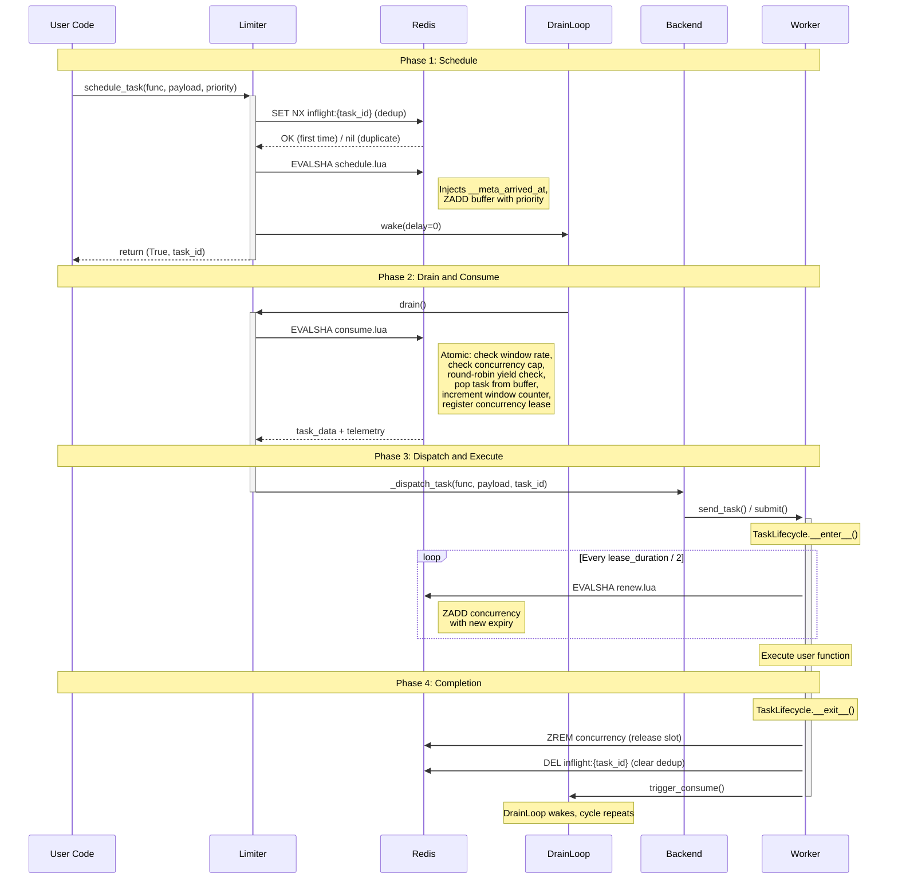
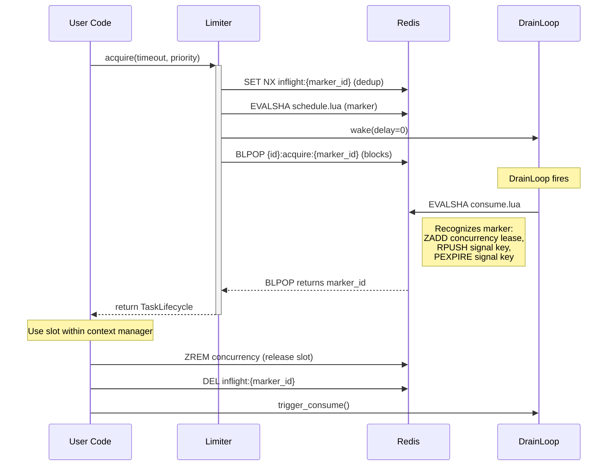

# Task Lifecycle Sequence

The sequence diagram traces the flow of a single task from the moment it is scheduled to the moment its execution completes. The diagram is divided into four phases, namely the *scheduling* phase, the *drain and consume* phase, the *dispatch and execution* phase and the *completion* phase. It should be noted that the diagram depicts the nominal flow exclusively. The handling of error conditions, such as script cache misses and task expiration to the dead letter queue, is documented in the [error handling](error-handling.md) reference.

Several observations can be made about the lifecycle:

- **Scheduling is synchronous**, i.e., the caller receives the result `(True, task_id)` immediately upon scheduling.
- **Consumption is asynchronous**: the `DrainLoop` runs in a background thread (sync backends) or as an `asyncio.Task` (async backends) and may fire milliseconds or seconds after the task has been scheduled.
- **Lua scripts are atomic**: `consume.lua` checks the rate window, verifies the concurrency capacity, pops the task from the buffer, increments the window counter and registers the concurrency lease, all within a single indivisible Redis operation. As such, race conditions between concurrent consumers are eliminated.
- **The heartbeat keeps the lease alive** during task execution. If the worker crashes, the lease expires and the concurrency slot is reclaimed automatically on the next consume invocation.
- **The cycle repeats**: the completion of a task triggers the `DrainLoop` to wake up and consume the next buffered task, which in turn closes the feedback loop.

## Inline Acquire Flow

The `acquire()` method provides an alternative entry point for callers that wish to block inline until a rate and concurrency slot becomes available, rather than scheduling a task for deferred execution. The mechanism reuses the existing buffer and drain loop infrastructure: the caller schedules a sentinel marker (with `func_path` set to `__redis_rate_limiter_acquire_marker__`) into the priority buffer and then blocks on `BLPOP` against a per-call signal key. When `consume.lua` dequeues the marker, it registers the concurrency lease via `ZADD` and atomically signals the caller via `RPUSH` on the signal key. The caller's `BLPOP` wakes, and `acquire()` returns a `TaskLifecycle` (sync) or `AsyncTaskLifecycle` (async) context manager that releases the slot on exit.

The marker carries an embedded deadline (`__meta_arrived_at + _acquire_timeout_ms`). If the drain loop does not reach the marker before the deadline elapses, `consume.lua` silently drops the marker (status -2) instead of admitting it, which prevents reserving a concurrency slot for a caller whose `BLPOP` has already timed out. Expired markers are not moved to the dead letter queue, because they represent abandoned admission attempts rather than failed task work.

**Inline acquire test coverage:**

| Phase | Description | Tested by |
|-------|-------------|-----------|
| Precondition | `acquire()` rejects non-positive timeout | `implementations/test_acquire::test_acquire_raises_value_error_for_non_positive_timeout`, `test_acquire_raises_value_error_for_zero_timeout` |
| Precondition | `acquire()` rejects call without drain loop | `implementations/test_acquire::test_acquire_raises_runtime_error_without_drain_loop` |
| Schedule | Marker scheduled with correct func_path | `implementations/test_acquire::test_acquire_schedules_marker_with_correct_func_path` |
| Schedule | Marker payload contains timeout in ms | `implementations/test_acquire::test_acquire_schedules_marker_with_timeout_in_payload` |
| Schedule | Marker payload contains UUID | `implementations/test_acquire::test_acquire_schedules_marker_with_uuid_in_payload` |
| Schedule | Marker scheduled with custom priority | `implementations/test_acquire::test_acquire_schedules_marker_with_custom_priority` |
| Schedule | max_age is ceiling of timeout | `implementations/test_acquire::test_acquire_max_age_is_ceiling_of_timeout` |
| Schedule | Buffer rejection raises RuntimeError | `implementations/test_acquire::test_acquire_raises_runtime_error_when_scheduling_fails` |
| BLPOP | BLPOP uses correct signal key | `implementations/test_acquire::test_acquire_blocks_on_correct_signal_key` |
| BLPOP | BLPOP None raises AcquireTimeout | `implementations/test_acquire::test_acquire_raises_acquire_timeout_on_blpop_none` |
| BLPOP | Timeout message contains limiter ID | `implementations/test_acquire::test_acquire_timeout_message_contains_limiter_id` |
| Return | Returns lifecycle with correct task ID | `implementations/test_acquire::test_acquire_returns_lifecycle_with_correct_task_id` |

**Standard lifecycle test coverage:**

| Phase | Message | Description | Tested by |
|-------|---------|-------------|-----------|
| **Schedule** | U → L: schedule_task() | Schedule invocation returns (bool, task_id) | `contracts/test_rate_limiter::test_schedule_task_returns_success_and_task_id` |
| **Schedule** | L → R: SET NX inflight | Deduplication via inflight key | `contracts/test_rate_limiter::test_schedule_task_marks_task_as_inflight`, `integration/test_rate_limiting::test_bulk_deduplication_only_buffers_one_task` |
| **Schedule** | L → R: EVALSHA schedule.lua | Buffer insertion | `contracts/test_rate_limiter::test_schedule_task_adds_to_buffer`, `implementations/test_rate_limiter::test_schedule_single_task_stores_correctly` |
| **Schedule** | L → D: wake(delay=0) | DrainLoop triggered after scheduling | `implementations/test_drain::test_trigger_consume_schedules_drain` |
| **Drain** | D → L: drain() | DrainLoop calls drain | `implementations/test_drain_loop::test_wake_default_delay_is_zero` |
| **Drain** | L → R: EVALSHA consume.lua | Atomic consumption with round-robin yield fairness | `contracts/test_rate_limiter::test_consume_returns_expected_structure`, `integration/test_rate_limiting::test_basic_rate_limit_enforcement` |
| **Execute** | L → B: _dispatch_task() | Backend dispatch | `implementations/test_drain::test_drain_dispatches_task_and_schedules_follow_up` |
| **Execute** | W: TaskLifecycle.__enter__() | Lifecycle context entered | `implementations/test_decorator::test_decorator_wraps_function_in_task_lifecycle` |
| **Execute** | W → R: EVALSHA renew.lua | Heartbeat lease renewal | `implementations/test_task_lifecycle::test_heartbeat_loop_calls_extend_lease_with_correct_parameters`, `implementations/test_task_lifecycle::test_extend_lease_succeeds_for_existing_task` |
| **Completion** | W: TaskLifecycle.__exit__() | Lifecycle context exit | `contracts/test_task_lifecycle::test_lifecycle_removes_task_from_concurrency_set` |
| **Completion** | W → R: ZREM + DEL | Slot released, dedup cleared | `contracts/test_task_lifecycle::test_lifecycle_removes_active_marker`, `integration/test_rate_limiting::test_task_lifecycle_releases_slot_on_error` |
| **Completion** | W → D: trigger_consume() | Feedback loop: completion triggers next drain | `contracts/test_task_lifecycle::test_lifecycle_triggers_consume`, `contracts/test_task_lifecycle::test_lifecycle_triggers_consume_even_on_exception` |
