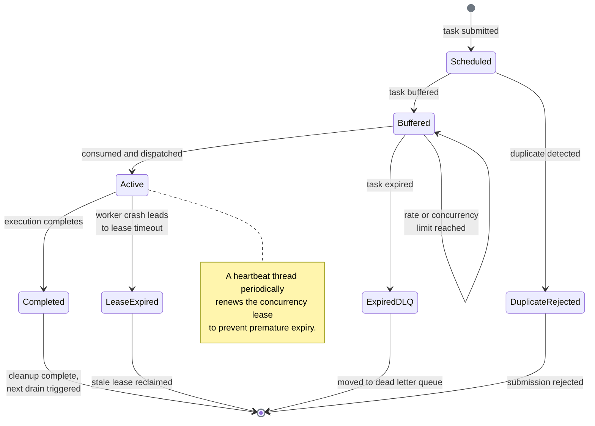

# Task State Diagram

The state diagram maps every possible state that a task can occupy from the moment it is submitted to the rate limiter through to its eventual completion or expiration. It captures both the nominal flow and the error recovery paths, including crash recovery via self-healing lease expiry and deduplication via inflight keys. The diagram should be read in conjunction with the [Task Lifecycle Sequence](task-lifecycle.md), which traces the nominal flow in detail.

There are seven distinct states in total. Of these, six represent physical locations within Redis (i.e., the task resides in a specific key or data structure), whereas one, *Duplicate Rejected*, represents a logical outcome that does not correspond to a persisted location: it is an immediate rejection at scheduling time before any buffer insertion occurs. Rate and concurrency exhaustion is modelled as a self-transition on the *Buffered* state rather than as a separate state, given that the task physically remains in the buffer ZSET throughout.

## State Diagram

**State descriptions:**

| State | Redis Location | Description |
|-------|----------------|-------------|
| **Scheduled** | Inflight key set via `SET NX` | `schedule_task()` has been called; the inflight key has been acquired and the task is about to be buffered via `schedule.lua`. |
| **Buffered** | `{id}:buffer` ZSET | The task resides in the buffer, ordered by priority, and awaits consumption by the drain loop. |
| **Expired (DLQ)** | `{id}:dlq` LIST | The `consume.lua` script determined that the task age exceeds the configured `max_age`; the task has been moved to the dead letter queue via `RPUSH` and its inflight key has been deleted. |
| **Active** | `{id}:concurrency` ZSET | The task has been consumed: the window counter has been incremented via `INCR`, a concurrency lease has been registered via `ZADD` with an expiry score, and the task has been popped from the buffer. The backend is dispatching or executing it. |
| **Lease Expired** | `{id}:concurrency` ZSET (stale entry) | The worker executing the task has crashed; the concurrency lease has expired (its score is less than the current timestamp) and will be cleaned up by the self-healing `ZREMRANGEBYSCORE` operation on the next `consume()` call. |
| **Completed** | None (all keys cleaned up) | `TaskLifecycle.__exit__()` has run: the concurrency lease has been removed via `ZREM`, the inflight key has been deleted via `DEL`, and `trigger_consume()` has been called to signal the drain loop. |
| **Duplicate Rejected** | Inflight key already exists | The `SET NX` for the inflight key failed, indicating that a task with the same identifier is already in flight; `schedule_task()` returns `(False, task_id)` immediately without buffering the task. |

**Test coverage:**

| Transition | Description | Tested by |
|------------|-------------|-----------|
| [*] → Scheduled | `schedule_task()` acquires inflight key via SET NX | `contracts/test_rate_limiter::test_schedule_task_returns_success_and_task_id`, `contracts/test_rate_limiter::test_schedule_task_marks_task_as_inflight` |
| Scheduled → Buffered | `schedule.lua` ZADD succeeds | `contracts/test_rate_limiter::test_schedule_task_adds_to_buffer`, `implementations/test_rate_limiter::test_schedule_single_task_stores_correctly` |
| Scheduled → DuplicateRejected | SET NX fails (inflight key exists) | `contracts/test_rate_limiter::test_schedule_duplicate_task_returns_false`, `implementations/test_rate_limiter::test_schedule_duplicate_task_skips_second` |
| DuplicateRejected → [*] | Returns (False, task_id) | `contracts/test_rate_limiter::test_schedule_duplicate_task_returns_false` |
| Buffered → Active | `consume.lua` succeeds (pop + lease + increment) | `contracts/test_rate_limiter::test_consume_returns_expected_structure`, `integration/test_rate_limiting::test_basic_rate_limit_enforcement` |
| Buffered → ExpiredDLQ | `consume.lua` finds age > max_age | `integration/test_rate_limiting::test_expired_task_moved_to_dlq` |
| Buffered → Buffered | Rate or concurrency limit exceeded; retry scheduled | `integration/test_rate_limiting::test_basic_rate_limit_enforcement`, `integration/test_rate_limiting::test_concurrency_limit_enforcement` |
| Active → Completed | `TaskLifecycle.__exit__()` runs | `contracts/test_task_lifecycle::test_lifecycle_removes_task_from_concurrency_set`, `contracts/test_task_lifecycle::test_lifecycle_removes_active_marker` |
| Active → LeaseExpired | Worker crashes; lease score < current time | `integration/test_rate_limiting::test_expired_lease_cleaned_up_on_consume` |
| Completed → [*] | Slot freed, inflight deleted, trigger_consume() called | `contracts/test_task_lifecycle::test_lifecycle_triggers_consume`, `integration/test_rate_limiting::test_task_lifecycle_releases_slot_on_error` |

## The Feedback Loop

The completion of a task initiates a feedback cycle that keeps the system operating at the configured throughput. When `TaskLifecycle.__exit__()` runs, it performs three operations in sequence: it removes the concurrency lease via `ZREM` on the `{id}:concurrency` ZSET, it deletes the inflight deduplication key via `DEL`, and it calls `trigger_consume()` on the limiter instance. The `trigger_consume()` method in turn wakes the `DrainLoop`, which calls `drain()`, which acquires the distributed lock and invokes `consume()` to pop the next task from the buffer. As such, every completed task immediately attempts to fill the freed concurrency slot with the next buffered task, thereby forming a self-sustaining cycle: completion triggers consumption, consumption triggers dispatch, and dispatch eventually triggers completion.

This feedback loop is the primary mechanism by which the system achieves maximum throughput within the configured rate and concurrency limits. Without it, the system would rely exclusively on the watchdog timer for forward progress. The [Drain Loop Flow](drain-flow.md) documents the three-layer drain control loop and the six feedback entry points in detail.

## Self-Healing Lease Expiry

When a worker crashes mid-execution, the concurrency lease it holds is not explicitly released. However, the lease is inherently time-bounded: when `consume.lua` registers a task in the `{id}:concurrency` ZSET via `ZADD`, it sets the score to `timestamp + lease_duration`, where `timestamp` is the current Redis server time. If the worker is healthy, the `TaskLifecycle` heartbeat thread renews the lease every `lease_duration / 2` seconds by updating the score to a new expiry time via `EVALSHA renew.lua`. If the worker crashes, the heartbeat ceases and the score becomes stale.

At the start of every `consume()` invocation, the `consume.lua` script executes `ZREMRANGEBYSCORE concurrency_key "-inf" (timestamp - 1)`, which removes all entries whose expiry score is less than the current timestamp. This operation reclaims the concurrency slots held by crashed workers, thereby making them available for new tasks. The self-healing mechanism requires no external coordination; it is performed atomically within the same Lua script that checks concurrency capacity, such that the slot count is always accurate at the moment of the consumption decision.

For additional detail on the concurrency ZSET and the lease score semantics, refer to the [Redis Key Map](redis-keys.md).

## Deduplication via Inflight Keys

Before buffering a task, `schedule_task()` attempts to set an inflight key of the form `{id}:inflight:{task_id}` using the Redis `SET NX` command with a computed TTL. The `NX` flag ensures that only the first caller succeeds; all subsequent callers observe that the key already exists and receive a `nil` response, at which point `schedule_task()` returns `(False, task_id)` to indicate that the task is a duplicate. This mechanism prevents the same logical task from being buffered, consumed and executed more than once.

The TTL for the inflight key is computed by the `_get_inflight_ttl()` method as `max(1, max_age) + max(1, lease_duration) + max(1, window)`, rounded up to the nearest integer. This formula ensures that the key survives the entire task lifecycle: the `max_age` term covers the maximum time a task may reside in the buffer, the `lease_duration` term covers the execution phase, and the `window` term provides an additional safety margin for window transitions and cleanup timing. Upon task completion, `TaskLifecycle.__exit__()` deletes the inflight key via `DEL`, which immediately allows the same task to be re-submitted.

The [Redis Key Map](redis-keys.md) documents the full key pattern and TTL formula.

## Crash Recovery

The system provides three complementary recovery mechanisms that together ensure forward progress even in the presence of worker crashes and lost signals:

1. **Lease expiry and self-healing**: when a worker crashes during task execution, its concurrency lease expires naturally because the heartbeat thread is no longer renewing it. The `ZREMRANGEBYSCORE` operation at the start of every `consume.lua` invocation removes the stale lease entry, thereby freeing the concurrency slot for reuse by the next consume attempt.

2. **Inflight key TTL**: the deduplication marker set during scheduling has a finite TTL that is computed to outlast the entire task lifecycle. If a worker crashes and the `TaskLifecycle.__exit__()` cleanup does not run, the inflight key eventually expires on its own. Once expired, the same task may be re-submitted by the caller, given that the `SET NX` check will succeed again.

3. **Watchdog timer**: the `DrainLoop` is configured with a watchdog interval of `max(5.0, window * 2)`. If no explicit `wake()` call is received within that interval (e.g., because all trigger signals were lost due to a network partition or a crash in the completion path), the loop fires a periodic drain anyway. This ensures that buffered tasks are eventually consumed even when the feedback loop is broken. With the introduction of cross-process Pub/Sub notifications, the watchdog serves as a safety net rather than a primary recovery mechanism.

These three mechanisms operate independently and do not require coordination. The lease expiry handles concurrency slot recovery, the inflight key TTL handles deduplication marker recovery, and the watchdog timer handles drain loop recovery. Together, they guarantee that the system converges to a healthy state without manual intervention.

## References

- [limiters.py](../../src/celery_rate_limiter/core/limiters.py): sync core implementation (scheduling, consumption, lifecycle management).
- [async_limiters.py](../../src/celery_rate_limiter/core/async_limiters.py): async core implementation (async scheduling, consumption, lifecycle management).
- [consume.lua](../../src/celery_rate_limiter/lua/consume.lua): atomic consumption script (state transitions within Redis).
- [schedule.lua](../../src/celery_rate_limiter/lua/schedule.lua): task scheduling script (buffer insertion).
- [Task Lifecycle Sequence](task-lifecycle.md): detailed sequence diagram of the nominal task flow.
- [Redis Key Map](redis-keys.md): key patterns, TTLs, and self-healing mechanisms.
- [Drain Loop Flow](drain-flow.md): the three-layer drain control loop and feedback entry points.
